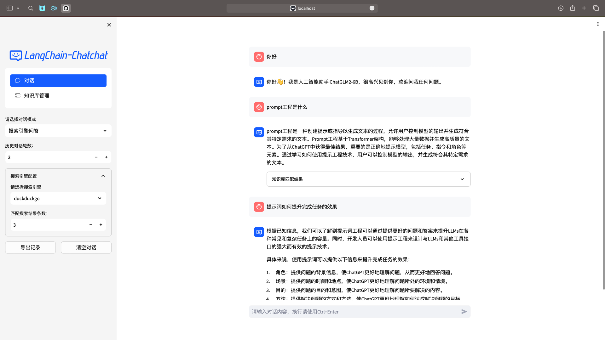
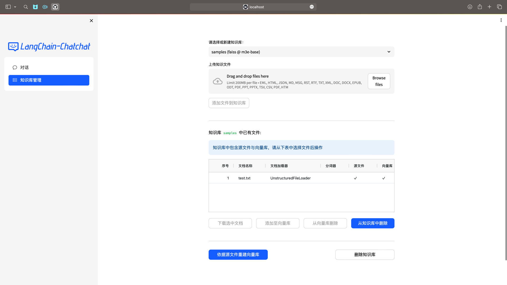

**LangChain-Chatchat** (formerly Langchain-ChatGLM): Implementation of a local knowledge base question-answering application based on Langchain and ChatGLM large language models.

## Table of Contents

* [Introduction](README.md#introduction)
* [Changelog](README.md#changelog)
* [Model Support](README.md#model-support)
* [Docker Deployment](README.md#docker-deployment)
* [Development Setup](README.md#development-setup)
  * [Software Requirements](README.md#software-requirements)
  * [1. Prepare Development Environment](README.md#1-prepare-development-environment)
  * [2. Download Models Locally](README.md#2-download-models-locally)
  * [3. Configure Settings](README.md#3-configure-settings)
  * [4. Initialize and Migrate Knowledge Base](README.md#4-initialize-and-migrate-knowledge-base)
  * [5. Start API or Web UI with One Command](README.md#5-start-api-or-web-ui-with-one-command)
  * [6. Start API or Web UI Step by Step](README.md#6-start-api-or-web-ui-step-by-step)
* [FAQ](README.md#faq)
* [Roadmap](README.md#roadmap)
* [Project Community](README.md#project-community)

---

## Introduction

🤖️ A local knowledge base question-answering application based on the idea of [langchain](https://github.com/hwchase17/langchain), aiming to build a knowledge base question-answering solution that is friendly to Chinese scenarios and open-source models, and can be deployed offline.

💡 Inspired by the projects [document.ai](https://github.com/GanymedeNil/document.ai) by [GanymedeNil](https://github.com/GanymedeNil) and the [ChatGLM-6B Pull Request](https://github.com/THUDM/ChatGLM-6B/pull/216) created by [AlexZhangji](https://github.com/AlexZhangji), this project establishes a local knowledge base question-answering application that can be implemented using open-source models. In the latest version of this project, models such as Vicuna, Alpaca, LLaMA, Koala, and RWKV are integrated using [FastChat](https://github.com/lm-sys/FastChat), and the application is supported by the [langchain](https://github.com/langchain-ai/langchain) framework, which provides API calling services based on [FastAPI](https://github.com/tiangolo/fastapi), or operations using the WebUI based on [Streamlit](https://github.com/streamlit/streamlit).

✅ With the support of open-source LLM and Embedding models, this project can achieve **offline private deployment** using **open-source** models. At the same time, this project also supports the use of the OpenAI GPT API, and will continue to expand the integration of various models and model APIs in the future.

⛓️ The implementation principle of this project is shown in the following diagram, which includes the process of loading files -> reading text -> text segmentation -> text vectorization -> question vectorization -> matching the most similar `top k` texts in the text vectors -> adding the matched text as context to the `prompt` along with the question -> submitting to `LLM` to generate an answer.

📺 [Introduction Video](https://www.bilibili.com/video/BV13M4y1e7cN/?share_source=copy_web&vd_source=e6c5aafe684f30fbe41925d61ca6d514)


From the perspective of document processing, the implementation process is as follows:


🚩 This project does not involve fine-tuning or training processes, but fine-tuning or training can be used to optimize the performance of this project.

🌐 [AutoDL Image](https://www.codewithgpu.com/i/imClumsyPanda/langchain-ChatGLM/Langchain-Chatchat) The code used in version `v7` of the image has been updated to version `v0.2.3` of this project.

🐳 [Docker Image](registry.cn-beijing.aliyuncs.com/chatchat/chatchat:0.2.3)

💻 Run Docker with one command 🌲:

```shell
docker run -d --gpus all -p 80:8501 registry.cn-beijing.aliyuncs.com/chatchat/chatchat:0.2.3
```

---

## Changelog

See [Release Notes](https://github.com/imClumsyPanda/langchain-ChatGLM/releases).

For users upgrading from version `0.1.x`, please note that you need to follow the steps in [Development Setup](README.md#3-configure-settings) to migrate your existing knowledge base to the new format. See [Knowledge Base Initialization and Migration](docs/INSTALL.md#knowledge-base-initialization-and-migration) for details.

### Differences between version `0.2.0` and version `0.1.x`

1. Use [FastChat](https://github.com/lm-sys/FastChat) to provide API access to open-source LLM models, improving the loading performance of LLM models.
2. Use the existing Chain implementation in [langchain](https://github.com/langchain-ai/langchain) to facilitate the integration of different types of Chains in the future, and conduct tests on Agent integration.
3. Use [FastAPI](https://github.com/tiangolo/fastapi) to provide API services, all interfaces can be tested in the automatically generated docs of FastAPI, and all dialogue interfaces support streaming or non-streaming output through parameters.
4. Use [Streamlit](https://github.com/streamlit/streamlit) to provide WebUI services, with the option to start the WebUI based on the API service, add session management, customize session themes and switch between them, and support the display of content in different formats in the future.
5. The default LLM model in the project is changed to [THUDM/chatglm2-6b](https://huggingface.co/THUDM/chatglm2-6b), and the default Embedding model is changed to [moka-ai/m3e-base](https://huggingface.co/moka-ai/m3e-base). The file loading method and text segmentation method have also been adjusted, and context expansion will be re-implemented in the future, with additional optional settings.
6. The project has expanded support for different types of vector libraries. In addition to supporting the [FAISS](https://github.com/facebookresearch/faiss) vector library, it also provides support for the [Milvus](https://github.com/milvus-io/milvus) and [PGVector](https://github.com/pgvector/pgvector) vector libraries.
7. The project's search engine dialogue has added the option to use DuckDuckGo search in addition to Bing search. DuckDuckGo search does not require an API Key and can be used directly in environments that can access foreign services.

---

## Model Support

The default LLM model used in this project is [THUDM/chatglm2-6b](https://huggingface.co/THUDM/chatglm2-6b), and the default Embedding model used is [moka-ai/m3e-base](https://huggingface.co/moka-ai/m3e-base).

### LLM Model Support

The latest version of this project integrates various LLM models based on [FastChat](https://github.com/lm-sys/FastChat), including:

- [meta-llama/Llama-2-7b-chat-hf](https://huggingface.co/meta-llama/Llama-2-7b-chat-hf)
- Vicuna, Alpaca, LLaMA, Koala
- [BlinkDL/RWKV-4-Raven](https://huggingface.co/BlinkDL/rwkv-4-raven)
- [camel-ai/CAMEL-13B-Combined-Data](https://huggingface.co/camel-ai/CAMEL-13B-Combined-Data)
- [databricks/dolly-v2-12b](https://huggingface.co/databricks/dolly-v2-12b)
- [FreedomIntelligence/phoenix-inst-chat-7b](https://huggingface.co/FreedomIntelligence/phoenix-inst-chat-7b)
- [h2oai/h2ogpt-gm-oasst1-en-2048-open-llama-7b](https://huggingface.co/h2oai/h2ogpt-gm-oasst1-en-2048-open-llama-7b)
- [lcw99/polyglot-ko-12.8b-chang-instruct-chat](https://huggingface.co/lcw99/polyglot-ko-12.8b-chang-instruct-chat)
- [lmsys/fastchat-t5-3b-v1.0](https://huggingface.co/lmsys/fastchat-t5)
- [mosaicml/mpt-7b-chat](https://huggingface.co/mosaicml/mpt-7b-chat)
- [Neutralzz/BiLLa-7B-SFT](https://huggingface.co/Neutralzz/BiLLa-7B-SFT)
- [nomic-ai/gpt4all-13b-snoozy](https://huggingface.co/nomic-ai/gpt4all-13b-snoozy)
- [NousResearch/Nous-Hermes-13b](https://huggingface.co/NousResearch/Nous-Hermes-13b)
- [openaccess-ai-collective/manticore-13b-chat-pyg](https://huggingface.co/openaccess-ai-collective/manticore-13b-chat-pyg)
- [OpenAssistant/oasst-sft-4-pythia-12b-epoch-3.5](https://huggingface.co/OpenAssistant/oasst-sft-4-pythia-12b-epoch-3.5)
- [project-baize/baize-v2-7b](https://huggingface.co/project-baize/baize-v2-7b)
- [Salesforce/codet5p-6b](https://huggingface.co/Salesforce/codet5p-6b)
- [StabilityAI/stablelm-tuned-alpha-7b](https://huggingface.co/stabilityai/stablelm-tuned-alpha-7b)
- [THUDM/chatglm-6b](https://huggingface.co/THUDM/chatglm-6b)
- [THUDM/chatglm2-6b](https://huggingface.co/THUDM/chatglm2-6b)
- [tiiuae/falcon-40b](https://huggingface.co/tiiuae/falcon-40b)
- [timdettmers/guanaco-33b-merged](https://huggingface.co/timdettmers/guanaco-33b-merged)
- [togethercomputer/RedPajama-INCITE-7B-Chat](https://huggingface.co/togethercomputer/RedPajama-INCITE-7B-Chat)
- [WizardLM/WizardLM-13B-V1.0](https://huggingface.co/WizardLM/WizardLM-13B-V1.0)
- [WizardLM/WizardCoder-15B-V1.0](https://huggingface.co/WizardLM/WizardCoder-15B-V1.0)
- [baichuan-inc/baichuan-7B](https://huggingface.co/baichuan-inc/baichuan-7B)
- [internlm/internlm-chat-7b](https://huggingface.co/internlm/internlm-chat-7b)
- [Qwen/Qwen-7B-Chat](https://huggingface.co/Qwen/Qwen-7B-Chat)
- [HuggingFaceH4/starchat-beta](https://huggingface.co/HuggingFaceH4/starchat-beta)
- Any pythia model from [EleutherAI](https://huggingface.co/EleutherAI), such as [pythia-6.9b](https://huggingface.co/EleutherAI/pythia-6.9b)
- Any adapter trained on top of the above models using [Peft](https://github.com/huggingface/peft). To activate, the model path must contain `peft`. Note: If you load multiple peft models, you can make them share the base model weights by setting the environment variable `PEFT_SHARE_BASE_WEIGHTS=true` in any model worker.

The list of supported models above may be continuously updated with the update of [FastChat](https://github.com/lm-sys/FastChat). Please refer to the [Supported Models List](https://github.com/lm-sys/FastChat/blob/main/docs/model_support.md) in FastChat for more information.

In addition to local models, this project also supports direct integration with the OpenAI API. The specific settings can be found in the `llm_model_dict` configuration information in `configs/model_configs.py.example`, under the `openai-chatgpt-3.5` configuration.

### Embedding Model Support

This project supports calling Embedding models from [HuggingFace](https://huggingface.co/models?pipeline_tag=sentence-similarity). The supported Embedding models include:

- [moka-ai/m3e-small](https://huggingface.co/moka-ai/m3e-small)
- [moka-ai/m3e-base](https://huggingface.co/moka-ai/m3e-base)
- [moka-ai/m3e-large](https://huggingface.co/moka-ai/m3e-large)
- [BAAI/bge-small-zh](https://huggingface.co/BAAI/bge-small-zh)
- [BAAI/bge-base-zh](https://huggingface.co/BAAI/bge-base-zh)
- [BAAI/bge-large-zh](https://huggingface.co/BAAI/bge-large-zh)
- [BAAI/bge-large-zh-noinstruct](https://huggingface.co/BAAI/bge-large-zh-noinstruct)
- [sensenova/piccolo-base-zh](https://huggingface.co/sensenova/piccolo-base-zh)
- [sensenova/piccolo-large-zh](https://huggingface.co/sensenova/piccolo-large-zh)
- [shibing624/text2vec-base-chinese-sentence](https://huggingface.co/shibing624/text2vec-base-chinese-sentence)
- [shibing624/text2vec-base-chinese-paraphrase](https://huggingface.co/shibing624/text2vec-base-chinese-paraphrase)
- [shibing624/text2vec-base-multilingual](https://huggingface.co/shibing624/text2vec-base-multilingual)
- [shibing624/text2vec-base-chinese](https://huggingface.co/shibing624/text2vec-base-chinese)
- [shibing624/text2vec-bge-large-chinese](https://huggingface.co/shibing624/text2vec-bge-large-chinese)
- [GanymedeNil/text2vec-large-chinese](https://huggingface.co/GanymedeNil/text2vec-large-chinese)
- [nghuyong/ernie-3.0-nano-zh](https://huggingface.co/nghuyong/ernie-3.0-nano-zh)
- [nghuyong/ernie-3.0-base-zh](https://huggingface.co/nghuyong/ernie-3.0-base-zh)
- [OpenAI/text-embedding-ada-002](https://platform.openai.com/docs/guides/embeddings)

---

## Docker Deployment

🐳 Docker image address: `registry.cn-beijing.aliyuncs.com/chatchat/chatchat:0.2.3)`

```shell
docker run -d --gpus all -p 80:8501 registry.cn-beijing.aliyuncs.com/chatchat/chatchat:0.2.3
```

- The size of this version's image is `35.3GB`, using `v0.2.3`, based on `nvidia/cuda:12.1.1-cudnn8-devel-ubuntu22.04` as the base image.
- This version includes two `embedding` models: `m3e-large` and `text2vec-bge-large-chinese`, with the latter being enabled by default. It also includes `chatglm2-6b-32k` by default.
- The goal of this version is to facilitate one-click deployment. Please make sure you have installed the NVIDIA driver on your Linux distribution.
- Please note that you do not need to install the CUDA toolkit on the host system, but you need to install the `NVIDIA Driver` and `NVIDIA Container Toolkit`. Please refer to the [installation guide](https://docs.nvidia.com/datacenter/cloud-native/container-toolkit/latest/install-guide.html).
- The first pull and start may take some time. If it gets stuck at the `Waiting..` step, it is recommended to use `docker exec -it <container id> bash` to enter the `/logs/` directory and check the corresponding log for that stage.

---

## Development Setup

### Software Requirements

This project has been tested on Python 3.8.1 - 3.10 and CUDA 11.7. It has been tested on Windows, ARM-based macOS, and Linux systems.

### 1. Prepare Development Environment

See [Development Environment Setup](docs/INSTALL.md).

**Please note:** Dependencies for version `0.2.3` and later may conflict with dependencies for version `0.1.x`. It is strongly recommended to create a new environment and reinstall the dependencies.

### 2. Download Models Locally

If you want to run this project locally or in an offline environment, you need to download the required models locally. Open-source LLM and Embedding models can usually be downloaded from [HuggingFace](https://huggingface.co/models).

Taking the default LLM model used in this project, [THUDM/chatglm2-6b](https://huggingface.co/THUDM/chatglm2-6b), and the default Embedding model, [moka-ai/m3e-base](https://huggingface.co/moka-ai/m3e-base), as examples:

To download the models, you need to first [install Git LFS](https://docs.github.com/en/repositories/working-with-files/managing-large-files/installing-git-large-file-storage), and then run the following commands:

```Shell
$ git clone https://huggingface.co/THUDM/chatglm2-6b

$ git clone https://huggingface.co/moka-ai/m3e-base
```

### 3. Configure Settings

Copy the template file [configs/model_config.py.example](configs/model_config.py.example) to the `./configs` directory in the project path, and rename it to `model_config.py`.

Copy the template file [configs/server_config.py.example](configs/server_config.py.example) to the `./configs` directory in the project path, and rename it to `server_config.py`.

Before running the Web UI or command-line interaction, please check whether the model parameter designs in `configs/model_config.py` and `configs/server_config.py` meet your requirements:

- Make sure the local storage path of the LLM model downloaded to your local machine is written in the `local_model_path` attribute of the corresponding model in the `llm_model_dict` in `model_config.py`, for example:

```python
llm_model_dict={
                "chatglm2-6b": {
                        "local_model_path": "/Users/xxx/Downloads/chatglm2-6b",
                        "api_base_url": "http://localhost:8888/v1",  # Modify "name" to the "api_base_url" in the FastChat service
                        "api_key": "EMPTY"
                    },
                }
```

- Make sure the local storage path of the Embedding model downloaded to your local machine is written in the corresponding model location in `embedding_model_dict`, for example:

```python
embedding_model_dict = {
                        "m3e-base": "/Users/xxx/Downloads/m3e-base",
                       }
```

If you choose to use the OpenAI Embedding model, please write the `key` of the model in `embedding_model_dict`. To use this model, you need to be able to access the OpenAI API or set up a proxy.

### 4. Initialize and Migrate Knowledge Base

The knowledge base information of this project is stored in a database. Before running the project, please initialize the database (we strongly recommend backing up your knowledge files before performing any operations).

- If you are upgrading from version `0.1.x`, please make sure the vector library type and Embedding model in the configuration file are consistent with the default settings in `configs/model_config.py`. If there are no changes, you only need to run the following command to add the existing knowledge base information to the database:

  ```shell
  $ python init_database.py
  ```

- If you are running this project for the first time, or the knowledge base has not been established, or the knowledge base type and Embedding model in the configuration file have changed, or the previous vector library did not enable `normalize_L2`, you need to run the following command to initialize or rebuild the knowledge base:

  ```shell
  $ python init_database.py --recreate-vs
  ```

### 5. Start API or Web UI with One Command

#### 5.1 Start Command

Use the startup.py script to start all Fastchat services, API services, and Web UI services with one command. Example command:

```shell
$ python startup.py -a
```

You can use `Ctrl + C` to directly stop all running services. If it doesn't stop after one try, you can press it multiple times.

Optional parameters include `-a (or --all-webui)`, `--all-api`, `--llm-api`, `-c (or --controller)`, `--openai-api`, `-m (or --model-worker)`, `--api`, `--webui`, where:

- `--all-webui` starts all dependent services for the Web UI.
- `--all-api` starts all dependent services for the API.
- `--llm-api` starts all dependent LLM services for Fastchat.
- `--openai-api` starts only the controller and openai-api-server services for FastChat.
- Others are options for starting individual services.

#### 5.2 Start with Non-default Models

If you want to specify a non-default model, you need to use the `--model-name` option. Example command:

```shell
$ python startup.py --all-webui --model-name Qwen-7B-Chat
```

More information can be found by running `python startup.py -h`.

#### 5.3 Multi-GPU Loading

The project supports multi-GPU loading. You need to modify the following three parameters in the `create_model_worker_app` function in startup.py:

```python
gpus=None, 
num_gpus=1, 
max_gpu_memory="20GiB"
```

Where `gpus` controls the IDs of the GPUs to be used, for example, "0,1";

`num_gpus` controls the number of GPUs to be used;

`max_gpu_memory` controls the amount of GPU memory to be used per card.

Note 1: The `FSCHAT_MODEL_WORKERS` dictionary in server_config.py also includes the corresponding configuration. If necessary, you can modify the corresponding parameters in the `FSCHAT_MODEL_WORKERS` dictionary to achieve multi-GPU loading.

Note 2: In some cases, the `gpus` parameter may not take effect. In this case, you need to specify the GPUs visible to torch by setting the environment variable `CUDA_VISIBLE_DEVICES`. Example command:

```shell
CUDA_VISIBLE_DEVICES=0,1 python startup.py -a
```

#### 5.4 PEFT Loading (including lora, p-tuning, prefix tuning, prompt tuning, ia3, etc.)

This project loads LLM services based on FastChat, so you need to load PEFT using FastChat. The path must contain the word "peft" to be recognized as a PEFT path, and the configuration file must be named `adapter_config.json`. The PEFT path should contain the PEFT weights in the `.bin` format. For detailed steps, please refer to [Loading Lora Fine-tuned Models Fails](https://github.com/chatchat-space/Langchain-Chatchat/issues/1130#issuecomment-1685291822).

#### **5.5 Notes:**

**1. The startup script starts the services of each module in a multi-process manner, which may cause printing order issues. Please wait for all services to start before making any calls, and call the services using the default or specified ports (default LLM API service port: `127.0.0.1:8888`, default API service port: `127.0.0.1:7861`, default Web UI service port: `your IP:8501`).**

**2. The startup time may vary depending on the device, usually taking 3-10 minutes. If it does not start after a long time, please go to the `/logs` directory to monitor the logs and troubleshoot the issue.**

**3. On Linux, exiting with `ctrl+C` may leave orphaned processes due to the Linux multiprocessing mechanism. You can use `shutdown_all.sh` to exit.**

#### 5.6 Startup Interface Example:

1. FastAPI docs interface


2. Web UI startup interface example:

- Web UI dialogue interface:
  
- Web UI knowledge base management page:
  

---

## FAQ

See [FAQ](docs/FAQ.md).

---

## Roadmap

- [X] Langchain Application
  - [X] Local Data Integration
    - [X] Integration of Unstructured Documents
      - [X] .md
      - [X] .txt
      - [X] .docx
    - [ ] Integration of Structured Data
      - [X] .csv
      - [ ] .xlsx
    - [ ] Local Web Page Integration
    - [ ] SQL Integration
    - [ ] Knowledge Graph/Graph Database Integration
  - [X] Search Engine Integration
    - [X] Bing Search
    - [X] DuckDuckGo Search
  - [ ] Agent Implementation
- [X] LLM Model Integration
  - [X] Support calling llm through [FastChat](https://github.com/lm-sys/fastchat) api
  - [ ] Support integration of LLM APIs such as ChatGLM API
- [X] Embedding Model Integration
  - [X] Support calling Embedding models from HuggingFace
  - [ ] Support integration of Embedding APIs such as OpenAI Embedding API
- [X] API based on FastAPI
- [X] Web UI
  - [X] Web UI based on Streamlit

---

## Project Community


🎉 WeChat group for langchain-ChatGLM project discussion. If you are interested in this project, you are welcome to join the group for discussion and communication.
