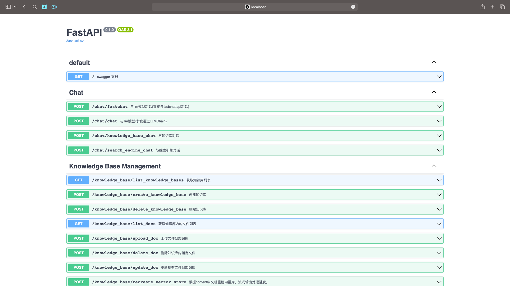
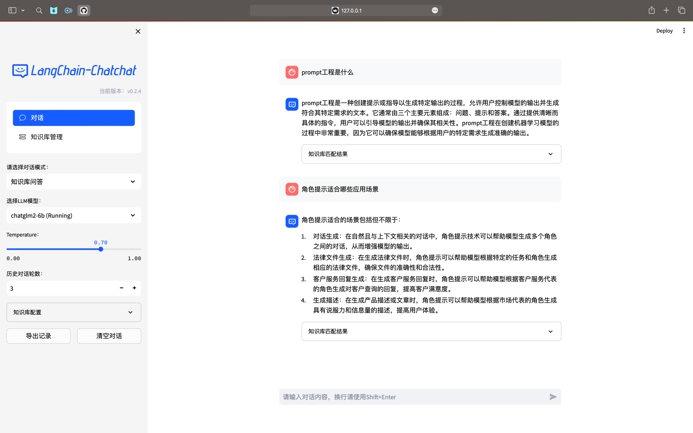
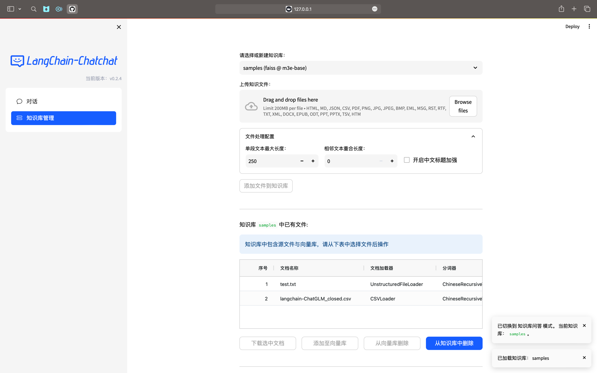

[](https://t.me/+RjliQ3jnJ1YyN2E9)

🌍 [READ THIS IN ENGLISH](README_en.md)

📃 **LangChain-Chatchat** (原 Langchain-ChatGLM):  基于 Langchain 与 ChatGLM 等大语言模型的本地知识库问答应用实现。

## 目录

* [介绍](README.md#介绍)
* [变更日志](README.md#变更日志)
* [模型支持](README.md#模型支持)
* [Docker 部署](README.md#Docker-部署)
* [开发部署](README.md#开发部署)
  * [软件需求](README.md#软件需求)
  * [1. 开发环境准备](README.md#1-开发环境准备)
  * [2. 下载模型至本地](README.md#2-下载模型至本地)
  * [3. 设置配置项](README.md#3-设置配置项)
  * [4. 知识库初始化与迁移](README.md#4-知识库初始化与迁移)
  * [5. 一键启动 API 服务或 Web UI](README.md#5-一键启动-API-服务或-Web-UI)
* [常见问题](README.md#常见问题)
* [路线图](README.md#路线图)
* [项目交流群](README.md#项目交流群)

---

## 介绍

🤖️ 一种利用 [langchain](https://github.com/hwchase17/langchain) 思想实现的基于本地知识库的问答应用，目标期望建立一套对中文场景与开源模型支持友好、可离线运行的知识库问答解决方案。

💡 受 [GanymedeNil](https://github.com/GanymedeNil) 的项目 [document.ai](https://github.com/GanymedeNil/document.ai) 和 [AlexZhangji](https://github.com/AlexZhangji) 创建的 [ChatGLM-6B Pull Request](https://github.com/THUDM/ChatGLM-6B/pull/216) 启发，建立了全流程可使用开源模型实现的本地知识库问答应用。本项目的最新版本中通过使用 [FastChat](https://github.com/lm-sys/FastChat) 接入 Vicuna, Alpaca, LLaMA, Koala, RWKV 等模型，依托于 [langchain](https://github.com/langchain-ai/langchain) 框架支持通过基于 [FastAPI](https://github.com/tiangolo/fastapi) 提供的 API 调用服务，或使用基于 [Streamlit](https://github.com/streamlit/streamlit) 的 WebUI 进行操作。

✅ 依托于本项目支持的开源 LLM 与 Embedding 模型，本项目可实现全部使用**开源**模型**离线私有部署**。与此同时，本项目也支持 OpenAI GPT API 的调用，并将在后续持续扩充对各类模型及模型 API 的接入。

⛓️ 本项目实现原理如下图所示，过程包括加载文件 -> 读取文本 -> 文本分割 -> 文本向量化 -> 问句向量化 -> 在文本向量中匹配出与问句向量最相似的 `top k`个 -> 匹配出的文本作为上下文和问题一起添加到 `prompt`中 -> 提交给 `LLM`生成回答。

📺 [原理介绍视频](https://www.bilibili.com/video/BV13M4y1e7cN/?share_source=copy_web&vd_source=e6c5aafe684f30fbe41925d61ca6d514)


从文档处理角度来看，实现流程如下：


🚩 本项目未涉及微调、训练过程，但可利用微调或训练对本项目效果进行优化。

🌐 [AutoDL 镜像](https://www.codewithgpu.com/i/imClumsyPanda/langchain-ChatGLM/Langchain-Chatchat) 中 `v8` 版本所使用代码已更新至本项目 `v0.2.4` 版本。

🐳 [Docker 镜像](registry.cn-beijing.aliyuncs.com/chatchat/chatchat:0.2.3)

💻 一行命令运行 Docker 🌲：

```shell
docker run -d --gpus all -p 80:8501 registry.cn-beijing.aliyuncs.com/chatchat/chatchat:0.2.3
```

---

## 变更日志

参见 [版本更新日志](https://github.com/imClumsyPanda/langchain-ChatGLM/releases)。

从 `0.1.x` 升级过来的用户请注意，需要按照[开发部署](README.md#3-开发部署)过程操作，将现有知识库迁移到新格式，具体见[知识库初始化与迁移](docs/INSTALL.md#知识库初始化与迁移)。

### `0.2.0` 版本与 `0.1.x` 版本区别

1. 使用 [FastChat](https://github.com/lm-sys/FastChat) 提供开源 LLM 模型的 API，以 OpenAI API 接口形式接入，提升 LLM 模型加载效果；
2. 使用 [langchain](https://github.com/langchain-ai/langchain) 中已有 Chain 的实现，便于后续接入不同类型 Chain，并将对 Agent 接入开展测试；
3. 使用 [FastAPI](https://github.com/tiangolo/fastapi) 提供 API 服务，全部接口可在 FastAPI 自动生成的 docs 中开展测试，且所有对话接口支持通过参数设置流式或非流式输出；
4. 使用 [Streamlit](https://github.com/streamlit/streamlit) 提供 WebUI 服务，可选是否基于 API 服务启动 WebUI，增加会话管理，可以自定义会话主题并切换，且后续可支持不同形式输出内容的显示；
5. 项目中默认 LLM 模型改为 [THUDM/chatglm2-6b](https://huggingface.co/THUDM/chatglm2-6b)，默认 Embedding 模型改为 [moka-ai/m3e-base](https://huggingface.co/moka-ai/m3e-base)，文件加载方式与文段划分方式也有调整，后续将重新实现上下文扩充，并增加可选设置；
6. 项目中扩充了对不同类型向量库的支持，除支持 [FAISS](https://github.com/facebookresearch/faiss) 向量库外，还提供 [Milvus](https://github.com/milvus-io/milvus), [PGVector](https://github.com/pgvector/pgvector) 向量库的接入；
7. 项目中搜索引擎对话，除 Bing 搜索外，增加 DuckDuckGo 搜索选项，DuckDuckGo 搜索无需配置 API Key，在可访问国外服务环境下可直接使用。

---

## 模型支持

本项目中默认使用的 LLM 模型为 [THUDM/chatglm2-6b](https://huggingface.co/THUDM/chatglm2-6b)，默认使用的 Embedding 模型为 [moka-ai/m3e-base](https://huggingface.co/moka-ai/m3e-base) 为例。

### LLM 模型支持

本项目最新版本中支持接入**本地模型**与**在线 LLM API**。

本地 LLM 模型接入基于 [FastChat](https://github.com/lm-sys/FastChat) 实现，支持模型如下：

- [meta-llama/Llama-2-7b-chat-hf](https://huggingface.co/meta-llama/Llama-2-7b-chat-hf)
- Vicuna, Alpaca, LLaMA, Koala
- [BlinkDL/RWKV-4-Raven](https://huggingface.co/BlinkDL/rwkv-4-raven)
- [camel-ai/CAMEL-13B-Combined-Data](https://huggingface.co/camel-ai/CAMEL-13B-Combined-Data)
- [databricks/dolly-v2-12b](https://huggingface.co/databricks/dolly-v2-12b)
- [FreedomIntelligence/phoenix-inst-chat-7b](https://huggingface.co/FreedomIntelligence/phoenix-inst-chat-7b)
- [h2oai/h2ogpt-gm-oasst1-en-2048-open-llama-7b](https://huggingface.co/h2oai/h2ogpt-gm-oasst1-en-2048-open-llama-7b)
- [lcw99/polyglot-ko-12.8b-chang-instruct-chat](https://huggingface.co/lcw99/polyglot-ko-12.8b-chang-instruct-chat)
- [lmsys/fastchat-t5-3b-v1.0](https://huggingface.co/lmsys/fastchat-t5)
- [mosaicml/mpt-7b-chat](https://huggingface.co/mosaicml/mpt-7b-chat)
- [Neutralzz/BiLLa-7B-SFT](https://huggingface.co/Neutralzz/BiLLa-7B-SFT)
- [nomic-ai/gpt4all-13b-snoozy](https://huggingface.co/nomic-ai/gpt4all-13b-snoozy)
- [NousResearch/Nous-Hermes-13b](https://huggingface.co/NousResearch/Nous-Hermes-13b)
- [openaccess-ai-collective/manticore-13b-chat-pyg](https://huggingface.co/openaccess-ai-collective/manticore-13b-chat-pyg)
- [OpenAssistant/oasst-sft-4-pythia-12b-epoch-3.5](https://huggingface.co/OpenAssistant/oasst-sft-4-pythia-12b-epoch-3.5)
- [project-baize/baize-v2-7b](https://huggingface.co/project-baize/baize-v2-7b)
- [Salesforce/codet5p-6b](https://huggingface.co/Salesforce/codet5p-6b)
- [StabilityAI/stablelm-tuned-alpha-7b](https://huggingface.co/stabilityai/stablelm-tuned-alpha-7b)
- [THUDM/chatglm-6b](https://huggingface.co/THUDM/chatglm-6b)
- [THUDM/chatglm2-6b](https://huggingface.co/THUDM/chatglm2-6b)
- [tiiuae/falcon-40b](https://huggingface.co/tiiuae/falcon-40b)
- [timdettmers/guanaco-33b-merged](https://huggingface.co/timdettmers/guanaco-33b-merged)
- [togethercomputer/RedPajama-INCITE-7B-Chat](https://huggingface.co/togethercomputer/RedPajama-INCITE-7B-Chat)
- [WizardLM/WizardLM-13B-V1.0](https://huggingface.co/WizardLM/WizardLM-13B-V1.0)
- [WizardLM/WizardCoder-15B-V1.0](https://huggingface.co/WizardLM/WizardCoder-15B-V1.0)
- [baichuan-inc/baichuan-7B](https://huggingface.co/baichuan-inc/baichuan-7B)
- [internlm/internlm-chat-7b](https://huggingface.co/internlm/internlm-chat-7b)
- [Qwen/Qwen-7B-Chat](https://huggingface.co/Qwen/Qwen-7B-Chat)
- [HuggingFaceH4/starchat-beta](https://huggingface.co/HuggingFaceH4/starchat-beta)
- [FlagAlpha/Llama2-Chinese-13b-Chat](https://huggingface.co/FlagAlpha/Llama2-Chinese-13b-Chat) and others
- [BAAI/AquilaChat-7B](https://huggingface.co/BAAI/AquilaChat-7B)
- [all models of OpenOrca](https://huggingface.co/Open-Orca)
- [Spicyboros](https://huggingface.co/jondurbin/spicyboros-7b-2.2?not-for-all-audiences=true) + [airoboros 2.2](https://huggingface.co/jondurbin/airoboros-l2-13b-2.2)
- [VMware&#39;s OpenLLaMa OpenInstruct](https://huggingface.co/VMware/open-llama-7b-open-instruct)
- 任何 [EleutherAI](https://huggingface.co/EleutherAI) 的 pythia 模型，如 [pythia-6.9b](https://huggingface.co/EleutherAI/pythia-6.9b)
- 在以上模型基础上训练的任何 [Peft](https://github.com/huggingface/peft) 适配器。为了激活，模型路径中必须有 `peft` 。注意：如果加载多个peft模型，你可以通过在任何模型工作器中设置环境变量 `PEFT_SHARE_BASE_WEIGHTS=true` 来使它们共享基础模型的权重。

以上模型支持列表可能随 [FastChat](https://github.com/lm-sys/FastChat) 更新而持续更新，可参考 [FastChat 已支持模型列表](https://github.com/lm-sys/FastChat/blob/main/docs/model_support.md)。


除本地模型外，本项目也支持直接接入 OpenAI API、智谱AI等在线模型，具体设置可参考 `configs/model_configs.py.example` 中的 `llm_model_dict` 的配置信息。

在线 LLM 模型目前已支持： 
- [ChatGPT](https://api.openai.com)
- [智谱AI](http://open.bigmodel.cn)
- [MiniMax](https://api.minimax.chat)
- [讯飞星火](https://xinghuo.xfyun.cn)
- [百度千帆](https://cloud.baidu.com/product/wenxinworkshop?track=dingbutonglan)
- [阿里云通义千问](https://dashscope.aliyun.com/)

项目中默认使用的 LLM 类型为 `THUDM/chatglm2-6b`，如需使用其他 LLM 类型，请在 [configs/model_config.py] 中对 `llm_model_dict` 和 `LLM_MODEL` 进行修改。

### Embedding 模型支持

本项目支持调用 [HuggingFace](https://huggingface.co/models?pipeline_tag=sentence-similarity) 中的 Embedding 模型，已支持的 Embedding 模型如下：

- [moka-ai/m3e-small](https://huggingface.co/moka-ai/m3e-small)
- [moka-ai/m3e-base](https://huggingface.co/moka-ai/m3e-base)
- [moka-ai/m3e-large](https://huggingface.co/moka-ai/m3e-large)
- [BAAI/bge-small-zh](https://huggingface.co/BAAI/bge-small-zh)
- [BAAI/bge-base-zh](https://huggingface.co/BAAI/bge-base-zh)
- [BAAI/bge-large-zh](https://huggingface.co/BAAI/bge-large-zh)
- [BAAI/bge-large-zh-noinstruct](https://huggingface.co/BAAI/bge-large-zh-noinstruct)
- [sensenova/piccolo-base-zh](https://huggingface.co/sensenova/piccolo-base-zh)
- [sensenova/piccolo-large-zh](https://huggingface.co/sensenova/piccolo-large-zh)
- [shibing624/text2vec-base-chinese-sentence](https://huggingface.co/shibing624/text2vec-base-chinese-sentence)
- [shibing624/text2vec-base-chinese-paraphrase](https://huggingface.co/shibing624/text2vec-base-chinese-paraphrase)
- [shibing624/text2vec-base-multilingual](https://huggingface.co/shibing624/text2vec-base-multilingual)
- [shibing624/text2vec-base-chinese](https://huggingface.co/shibing624/text2vec-base-chinese)
- [shibing624/text2vec-bge-large-chinese](https://huggingface.co/shibing624/text2vec-bge-large-chinese)
- [GanymedeNil/text2vec-large-chinese](https://huggingface.co/GanymedeNil/text2vec-large-chinese)
- [nghuyong/ernie-3.0-nano-zh](https://huggingface.co/nghuyong/ernie-3.0-nano-zh)
- [nghuyong/ernie-3.0-base-zh](https://huggingface.co/nghuyong/ernie-3.0-base-zh)
- [OpenAI/text-embedding-ada-002](https://platform.openai.com/docs/guides/embeddings)

项目中默认使用的 Embedding 类型为 `moka-ai/m3e-base`，如需使用其他 Embedding 类型，请在 [configs/model_config.py] 中对 `embedding_model_dict` 和 `EMBEDDING_MODEL` 进行修改。

---

### Text Splitter 个性化支持

本项目支持调用 [Langchain](https://api.python.langchain.com/en/latest/api_reference.html#module-langchain.text_splitter) 的 Text Splitter 分词器以及基于此改进的自定义分词器，已支持的 Text Splitter 类型如下：

- CharacterTextSplitter
- LatexTextSplitter
- MarkdownHeaderTextSplitter
- MarkdownTextSplitter
- NLTKTextSplitter
- PythonCodeTextSplitter
- RecursiveCharacterTextSplitter
- SentenceTransformersTokenTextSplitter
- SpacyTextSplitter

已经支持的定制分词器如下：

- [AliTextSplitter](text_splitter/ali_text_splitter.py)
- [ChineseRecursiveTextSplitter](text_splitter/chinese_recursive_text_splitter.py)
- [ChineseTextSplitter](text_splitter/chinese_text_splitter.py)

项目中默认使用的 Text Splitter 类型为 `ChineseRecursiveTextSplitter`，如需使用其他 Text Splitter 类型，请在 [configs/model_config.py] 中对 `text_splitter_dict` 和 `TEXT_SPLITTER` 进行修改。

关于如何使用自定义分词器和贡献自己的分词器，可以参考[Text Splitter 贡献说明](docs/splitter.md)。

## Docker 部署

🐳 Docker 镜像地址: `registry.cn-beijing.aliyuncs.com/chatchat/chatchat:0.2.3)`

```shell
docker run -d --gpus all -p 80:8501 registry.cn-beijing.aliyuncs.com/chatchat/chatchat:0.2.3
```

- 该版本镜像大小 `35.3GB`，使用 `v0.2.3`，以 `nvidia/cuda:12.1.1-cudnn8-devel-ubuntu22.04` 为基础镜像
- 该版本内置两个 `embedding` 模型：`m3e-large`，`text2vec-bge-large-chinese`，默认启用后者，内置 `chatglm2-6b-32k`
- 该版本目标为方便一键部署使用，请确保您已经在Linux发行版上安装了NVIDIA驱动程序
- 请注意，您不需要在主机系统上安装CUDA工具包，但需要安装 `NVIDIA Driver` 以及 `NVIDIA Container Toolkit`，请参考[安装指南](https://docs.nvidia.com/datacenter/cloud-native/container-toolkit/latest/install-guide.html)
- 首次拉取和启动均需要一定时间，首次启动时请参照下图使用 `docker logs -f <container id>` 查看日志
- 如遇到启动过程卡在 `Waiting..` 步骤，建议使用 `docker exec -it <container id> bash` 进入 `/logs/` 目录查看对应阶段日志

---

## 开发部署

### 软件需求

本项目已在 Python 3.8.1 - 3.10，CUDA 11.7 环境下完成测试。已在 Windows、ARM 架构的 macOS、Linux 系统中完成测试。

### 1. 开发环境准备

参见 [开发环境准备](docs/INSTALL.md)。

**请注意：** `0.2.3` 及更新版本的依赖包与 `0.1.x` 版本依赖包可能发生冲突，强烈建议新建环境后重新安装依赖包。

### 2. 下载模型至本地

如需在本地或离线环境下运行本项目，需要首先将项目所需的模型下载至本地，通常开源 LLM 与 Embedding 模型可以从 [HuggingFace](https://huggingface.co/models) 下载。

以本项目中默认使用的 LLM 模型 [THUDM/chatglm2-6b](https://huggingface.co/THUDM/chatglm2-6b) 与 Embedding 模型 [moka-ai/m3e-base](https://huggingface.co/moka-ai/m3e-base) 为例：

下载模型需要先[安装Git LFS](https://docs.github.com/zh/repositories/working-with-files/managing-large-files/installing-git-large-file-storage)，然后运行

```Shell
$ git clone https://huggingface.co/THUDM/chatglm2-6b

$ git clone https://huggingface.co/moka-ai/m3e-base
```

### 3. 设置配置项

复制模型相关参数配置模板文件 [configs/model_config.py.example](configs/model_config.py.example) 存储至项目路径下 `./configs` 路径下，并重命名为 `model_config.py`。

复制服务相关参数配置模板文件 [configs/server_config.py.example](configs/server_config.py.example) 存储至项目路径下 `./configs` 路径下，并重命名为 `server_config.py`。

在开始执行 Web UI 或命令行交互前，请先检查 [configs/model_config.py](configs/model_config.py) 和 [configs/server_config.py](configs/server_config.py) 中的各项模型参数设计是否符合需求：

- 请确认已下载至本地的 LLM 模型本地存储路径写在 `llm_model_dict` 对应模型的 `local_model_path` 属性中，如:

```python
llm_model_dict={
                "chatglm2-6b": {
                        "local_model_path": "/Users/xxx/Downloads/chatglm2-6b",
                        "api_base_url": "http://localhost:8888/v1",  # "name"修改为 FastChat 服务中的"api_base_url"
                        "api_key": "EMPTY"
                    },
                }
```

- 请确认已下载至本地的 Embedding 模型本地存储路径写在 `embedding_model_dict` 对应模型位置，如：

```python
embedding_model_dict = {
                        "m3e-base": "/Users/xxx/Downloads/m3e-base",
                       }
```

- 请确认本地分词器路径是否已经填写，如：

```python
text_splitter_dict = {
    "ChineseRecursiveTextSplitter": {
        "source": "huggingface",  ## 选择tiktoken则使用openai的方法,不填写则默认为字符长度切割方法。
        "tokenizer_name_or_path": "", ## 空格不填则默认使用大模型的分词器。 
    }
}
```

如果你选择使用OpenAI的Embedding模型，请将模型的 ``key``写入 `embedding_model_dict`中。使用该模型，你需要能够访问OpenAI官的API，或设置代理。

### 4. 知识库初始化与迁移

当前项目的知识库信息存储在数据库中，在正式运行项目之前请先初始化数据库（我们强烈建议您在执行操作前备份您的知识文件）。

- 如果您是从 `0.1.x` 版本升级过来的用户，针对已建立的知识库，请确认知识库的向量库类型、Embedding 模型与 `configs/model_config.py` 中默认设置一致，如无变化只需以下命令将现有知识库信息添加到数据库即可：

  ```shell
  $ python init_database.py
  ```
- 如果您是第一次运行本项目，知识库尚未建立，或者配置文件中的知识库类型、嵌入模型发生变化，或者之前的向量库没有开启 `normalize_L2`，需要以下命令初始化或重建知识库：

  ```shell
  $ python init_database.py --recreate-vs
  ```

### 5. 一键启动 API 服务或 Web UI

#### 5.1 启动命令

一键启动脚本 startup.py,一键启动所有 Fastchat 服务、API 服务、WebUI 服务，示例代码：

```shell
$ python startup.py -a
```

并可使用 `Ctrl + C` 直接关闭所有运行服务。如果一次结束不了，可以多按几次。

可选参数包括 `-a (或--all-webui)`, `--all-api`, `--llm-api`, `-c (或--controller)`, `--openai-api`,
`-m (或--model-worker)`, `--api`, `--webui`，其中：

- `--all-webui` 为一键启动 WebUI 所有依赖服务；
- `--all-api` 为一键启动 API 所有依赖服务；
- `--llm-api` 为一键启动 Fastchat 所有依赖的 LLM 服务；
- `--openai-api` 为仅启动 FastChat 的 controller 和 openai-api-server 服务；
- 其他为单独服务启动选项。

#### 5.2 启动非默认模型

若想指定非默认模型，需要用 `--model-name` 选项，示例：

```shell
$ python startup.py --all-webui --model-name Qwen-7B-Chat
```

更多信息可通过 `python startup.py -h`查看。

#### 5.3 多卡加载

项目支持多卡加载，需在 startup.py 中的 create_model_worker_app 函数中，修改如下三个参数:

```python
gpus=None, 
num_gpus=1, 
max_gpu_memory="20GiB"
```

其中，`gpus` 控制使用的显卡的ID，例如 "0,1";

`num_gpus` 控制使用的卡数;

`max_gpu_memory` 控制每个卡使用的显存容量。

注1：server_config.py的FSCHAT_MODEL_WORKERS字典中也增加了相关配置，如有需要也可通过修改FSCHAT_MODEL_WORKERS字典中对应参数实现多卡加载。

注2：少数情况下，gpus参数会不生效，此时需要通过设置环境变量CUDA_VISIBLE_DEVICES来指定torch可见的gpu,示例代码：

```shell
CUDA_VISIBLE_DEVICES=0,1 python startup.py -a
```

#### 5.4 PEFT 加载(包括lora,p-tuning,prefix tuning, prompt tuning,ia3等)

本项目基于 FastChat 加载 LLM 服务，故需以 FastChat 加载 PEFT 路径，即保证路径名称里必须有 peft 这个词，配置文件的名字为 adapter_config.json，peft 路径下包含.bin 格式的 PEFT 权重，peft路径在startup.py中create_model_worker_app函数的args.model_names中指定，并开启环境变量PEFT_SHARE_BASE_WEIGHTS=true参数。

注：如果上述方式启动失败，则需要以标准的fastchat服务启动方式分步启动，分步启动步骤参考第六节，PEFT加载详细步骤参考[加载lora微调后模型失效](https://github.com/chatchat-space/Langchain-Chatchat/issues/1130#issuecomment-1685291822)，

#### **5.5 注意事项：**

**1. startup 脚本用多进程方式启动各模块的服务，可能会导致打印顺序问题，请等待全部服务发起后再调用，并根据默认或指定端口调用服务（默认 LLM API 服务端口：`127.0.0.1:8888`,默认 API 服务端口：`127.0.0.1:7861`,默认 WebUI 服务端口：`本机IP：8501`)**

**2.服务启动时间示设备不同而不同，约 3-10 分钟，如长时间没有启动请前往 `./logs`目录下监控日志，定位问题。**

**3. 在Linux上使用ctrl+C退出可能会由于linux的多进程机制导致multiprocessing遗留孤儿进程，可通过shutdown_all.sh进行退出**

#### 5.6 启动界面示例：

1. FastAPI docs 界面



2. webui启动界面示例：

- Web UI 对话界面：



- Web UI 知识库管理页面：



---

## 常见问题

参见 [常见问题](docs/FAQ.md)。

---

## 路线图

- [X] Langchain 应用
  - [X] 本地数据接入
    - [X] 接入非结构化文档
      - [X] .md
      - [X] .txt
      - [X] .docx
    - [ ] 结构化数据接入
      - [X] .csv
      - [ ] .xlsx
    - [ ] 分词及召回
      - [ ] 接入不同类型 TextSplitter
      - [ ] 优化依据中文标点符号设计的 ChineseTextSplitter
      - [ ] 重新实现上下文拼接召回
    - [ ] 本地网页接入
    - [ ] SQL 接入
    - [ ] 知识图谱/图数据库接入
  - [X] 搜索引擎接入
    - [X] Bing 搜索
    - [X] DuckDuckGo 搜索
  - [ ] Agent 实现
- [X] LLM 模型接入
  - [X] 支持通过调用 [FastChat](https://github.com/lm-sys/fastchat) api 调用 llm
  - [ ] 支持 ChatGLM API 等 LLM API 的接入
- [X] Embedding 模型接入
  - [X] 支持调用 HuggingFace 中各开源 Emebdding 模型
  - [ ] 支持 OpenAI Embedding API 等 Embedding API 的接入
- [X] 基于 FastAPI 的 API 方式调用
- [X] Web UI
  - [X] 基于 Streamlit 的 Web UI

---

## 项目交流群


🎉 langchain-ChatGLM 项目微信交流群，如果你也对本项目感兴趣，欢迎加入群聊参与讨论交流。
