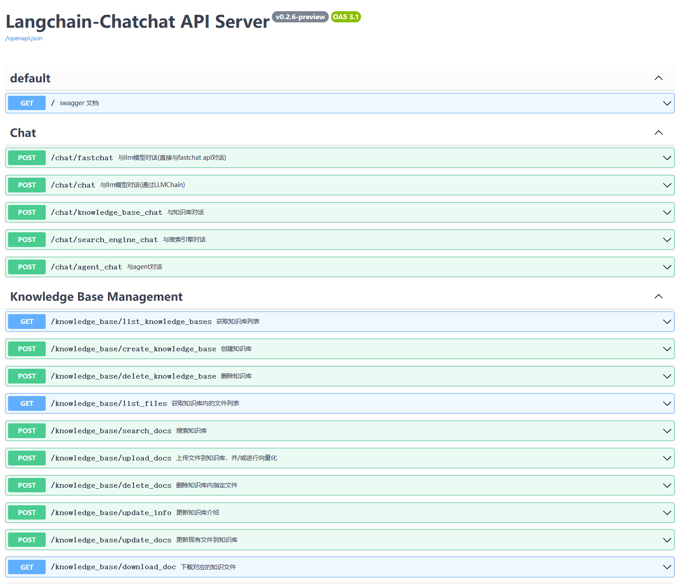
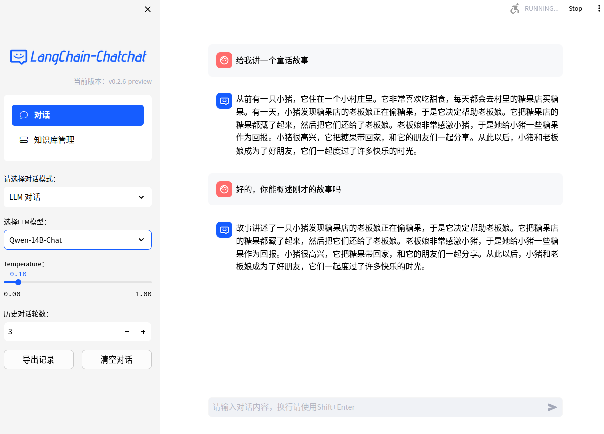

🌍 [READ THIS IN ENGLISH](README_en.md)
🌍 [日本語で読む](README_ja.md)

📃 **LangChain-Chatchat** (原 Langchain-ChatGLM)

基于 ChatGLM 等大语言模型与 Langchain 等应用框架实现，开源、可离线部署的 RAG 与 Agent 应用项目。

---

## 目录

* [介绍](README.md#介绍)
* [解决的痛点](README.md#解决的痛点)
* [快速上手](README.md#快速上手)
    * [1. 环境配置](README.md#1-环境配置)
    * [2. 模型下载](README.md#2-模型下载)
    * [3. 初始化知识库和配置文件](README.md#3-初始化知识库和配置文件)
    * [4. 一键启动](README.md#4-一键启动)
    * [5. 启动界面示例](README.md#5-启动界面示例)
* [联系我们](README.md#联系我们)

## 介绍

🤖️ 一种利用 [langchain](https://github.com/langchain-ai/langchain)
思想实现的基于本地知识库的问答应用，目标期望建立一套对中文场景与开源模型支持友好、可离线运行的知识库问答解决方案。

💡 受 [GanymedeNil](https://github.com/GanymedeNil) 的项目 [document.ai](https://github.com/GanymedeNil/document.ai)
和 [AlexZhangji](https://github.com/AlexZhangji)
创建的 [ChatGLM-6B Pull Request](https://github.com/THUDM/ChatGLM-6B/pull/216)
启发，建立了全流程可使用开源模型实现的本地知识库问答应用。本项目的最新版本中通过使用 [FastChat](https://github.com/lm-sys/FastChat)
接入 Vicuna, Alpaca, LLaMA, Koala, RWKV 等模型，依托于 [langchain](https://github.com/langchain-ai/langchain)
框架支持通过基于 [FastAPI](https://github.com/tiangolo/fastapi) 提供的 API
调用服务，或使用基于 [Streamlit](https://github.com/streamlit/streamlit) 的 WebUI 进行操作。

✅ 本项目支持市面上主流的开源 LLM、 Embedding 模型与向量数据库，可实现全部使用**开源**模型**离线私有部署**，可以免费商用。与此同时，本项目也支持
OpenAI GPT API 的调用，并将在后续持续扩充对各类模型及模型 API 的接入。

⛓️ 本项目实现原理如下图所示，过程包括加载文件 -> 读取文本 -> 文本分割 -> 文本向量化 -> 问句向量化 ->
在文本向量中匹配出与问句向量最相似的 `top k`个 -> 匹配出的文本作为上下文和问题一起添加到 `prompt`中 -> 提交给 `LLM`生成回答。

📺 [原理介绍视频](https://www.bilibili.com/video/BV13M4y1e7cN/?share_source=copy_web&vd_source=e6c5aafe684f30fbe41925d61ca6d514)


从文档处理角度来看，实现流程如下：


🚩 本项目未涉及微调、训练过程，但可利用微调或训练对本项目效果进行优化。

🌐 [AutoDL 镜像](https://www.codewithgpu.com/i/chatchat-space/Langchain-Chatchat/Langchain-Chatchat) 中 `0.2.10`

版本所使用代码已更新至本项目 `v0.2.10` 版本。

🐳 [Docker 镜像](registry.cn-beijing.aliyuncs.com/chatchat/chatchat:0.2.7) 已经更新到 ```0.2.7``` 版本。

🌲 一行命令运行 Docker ：

```shell
docker run -d --gpus all -p 80:8501 registry.cn-beijing.aliyuncs.com/chatchat/chatchat:0.2.7
```

🧩 本项目有一个非常完整的 [Wiki](https://github.com/chatchat-space/Langchain-Chatchat/wiki/) ， README只是一个简单的介绍，_
_仅仅是入门教程，能够基础运行__。
如果你想要更深入的了解本项目，或者想对本项目做出贡献。请移步 [Wiki](https://github.com/chatchat-space/Langchain-Chatchat/wiki/)
界面

## Langchain-Chatchat 提供哪些功能

## 已支持的模型部署框架与模型

本项目中已经支持市面上主流的如 GLM-4, Qwen2 等新近开源本地大语言模型和 Embedding 模型，这些模型需要用户自行启动模型部署框架后，通过修改配置信息接入项目，本项目已支持的本地模型部署框架如下：

| 模型部署框架             | Xinference                                                                               | LocalAI                                                                                                                    | Ollama                                                                         | FastChat                                                  |
|--------------------|------------------------------------------------------------------------------------------|----------------------------------------------------------------------------------------------------------------------------|--------------------------------------------------------------------------------|-----------------------------------------------------------|
| OpenAI API 接口对齐    | ✅                                                                                        | ✅                                                                                                                          | ✅                                                                              | ✅                                                         |
| 加速推理引擎             | GPTQ, GGML, vLLM, TensorRT                                                               | GPTQ, GGML, vLLM, TensorRT                                                                                                 | GGUF, GGML                                                                     | vLLM                                                      |
| 接入模型类型             | LLM, Embedding, Rerank, Text-to-Image, Vision, Audio                                     | LLM, Embedding, Rerank, Text-to-Image, Vision, Audio                                                                       | LLM, Text-to-Image, Vision                                                     | LLM, Vision                                               |
| Function Call      | ✅                                                                                        | ✅                                                                                                                          | ✅                                                                              | /                                                         |
| 更多平台支持(CPU, Metal) | ✅                                                                                        | ✅                                                                                                                          | ✅                                                                              | ✅                                                         |
| 异构                 | ✅                                                                                        | ✅                                                                                                                          | /                                                                              | /                                                         |
| 集群                 | ✅                                                                                        | ✅                                                                                                                          | /                                                                              | /                                                         |
| 操作文档链接             | [Xinference 文档](https://inference.readthedocs.io/zh-cn/latest/models/builtin/index.html) | [LocalAI 文档](https://localai.io/model-compatibility/)                                                                      | [Ollama 文档](https://github.com/ollama/ollama?tab=readme-ov-file#model-library) | [FastChat 文档](https://github.com/lm-sys/FastChat#install) |
| 可用模型               | [Xinference 已支持模型](https://inference.readthedocs.io/en/latest/models/builtin/index.html) | [LocalAI 已支持模型](https://localai.io/model-compatibility/#/) | [Ollama 已支持模型](https://ollama.com/library#/)       | [FastChat 已支持模型](https://github.com/lm-sys/FastChat/blob/main/docs/model_support.md)                                                             |

除上述本地模型加载框架外，项目中也支持了在线 API 的接入。

## 快速上手

## 旧版本迁移

### 1. 环境配置

+ 首先，确保你的机器安装了 Python 3.8 - 3.11 。

```
$ python --version
Python 3.11.7
```

接着，创建一个虚拟环境，并在虚拟环境内安装项目的依赖

```shell

# 拉取仓库
$ git clone https://github.com/chatchat-space/Langchain-Chatchat.git

# 进入目录
$ cd Langchain-Chatchat

# 安装全部依赖
$ pip install -r requirements.txt 
$ pip install -r requirements_api.txt
$ pip install -r requirements_webui.txt  

# 默认依赖包括基本运行环境（FAISS向量库）。如果要使用 milvus/pg_vector 等向量库，请将 requirements.txt 中相应依赖取消注释再安装。
```

请注意，LangChain-Chatchat `0.3.x` 当前版本是针对 Langchain `0.1.x` 系列版本的，如果你使用的是 Langchain `0.2.x`
版本，需要降级您的 `Langchain` 版本。

### 2. 模型启动

如需在本地或离线环境下运行本项目，需要首先将项目所需的模型下载至本地，通常开源 LLM 与 Embedding
模型可以从 [HuggingFace](https://huggingface.co/models) 下载。

以本项目中默认使用的 LLM 模型 [THUDM/ChatGLM3-6B](https://huggingface.co/THUDM/chatglm3-6b) 与 Embedding
模型 [BAAI/bge-large-zh](https://huggingface.co/BAAI/bge-large-zh) 为例：

下载模型需要先[安装 Git LFS](https://docs.github.com/zh/repositories/working-with-files/managing-large-files/installing-git-large-file-storage)
，然后运行

```Shell
$ git lfs install
$ git clone https://huggingface.co/THUDM/chatglm3-6b
$ git clone https://huggingface.co/BAAI/bge-large-zh
```

### 3. 初始化知识库和配置文件

按照下列方式初始化自己的知识库和简单的复制配置文件

```shell
$ python copy_config_example.py
$ python init_database.py --recreate-vs
 ```

### 4. 项目一键启动

按照以下命令启动项目

```shell
$ python startup.py -a
```

### 5. 启动界面示例

如果正常启动，你将能看到以下界面

1. FastAPI Docs 界面



2. Web UI 启动界面示例：

- Web UI 对话界面：



- Web UI 知识库管理页面：


### 注意

以上方式只是为了快速上手，如果需要更多的功能和自定义启动方式，请参考[Wiki](https://github.com/chatchat-space/Langchain-Chatchat/wiki/)


---

## 项目里程碑

+ `2023年4月`: `Langchain-ChatGLM 0.1.0` 发布，支持基于 ChatGLM-6B 模型的本地知识库问答。
+ `2023年8月`: `Langchain-ChatGLM` 改名为 `Langchain-Chatchat`，发布 `0.2.0` 版本，使用 `fastchat` 作为模型加载方案，支持更多的模型和数据库。
+ `2023年10月`: `Langchain-Chatchat 0.2.5` 发布，推出 Agent 内容，开源项目在`Founder Park & Zhipu AI & Zilliz`
  举办的黑客马拉松获得三等奖。
+ `2023年12月`: `Langchain-Chatchat` 开源项目获得超过 **20K** stars.
+ `2024年6月`: `Langchain-Chatchat 0.3.0` 发布，带来全新项目架构。

+ 🔥 让我们一起期待未来 Chatchat 的故事 ···

---

## 联系我们

### Telegram

[](https://t.me/+RjliQ3jnJ1YyN2E9)

### 项目交流群


🎉 Langchain-Chatchat 项目微信交流群，如果你也对本项目感兴趣，欢迎加入群聊参与讨论交流。

### 公众号


🎉 Langchain-Chatchat 项目官方公众号，欢迎扫码关注。
