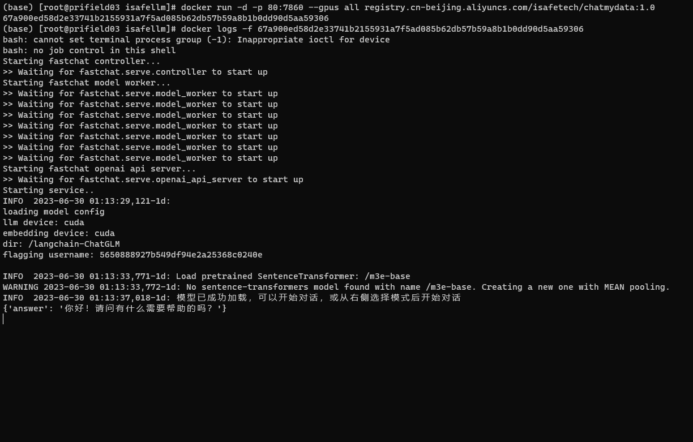

# 基于本地知识库的 ChatGLM 等大语言模型应用实现

## 目录

* [介绍](README.md#介绍)
* [变更日志](README.md#变更日志)
* [模型支持](README.md#模型支持)
* [Docker 整合包](README.md#Docker-整合包)
* [Docker 部署](README.md#Docker-部署)
* [开发部署](README.md#开发部署)
  * [软件需求](README.md#软件需求)
  * [1. 开发环境准备](README.md#1.-开发环境准备)
  * [2. 下载模型至本地](README.md#2.-下载模型至本地)
  * [3. 设置配置项](README.md#3.-设置配置项)
  * [4. 启动 API 服务或 Web UI](README.md#4.-启动-API-服务或-Web-UI)
* [常见问题](README.md#常见问题)
* [路线图](README.md#路线图)
* [项目交流群](README.md#项目交流群)

## 介绍

🤖️ 一种利用 [langchain](https://github.com/hwchase17/langchain) 思想实现的基于本地知识库的问答应用，目标期望建立一套对中文场景与开源模型支持友好、可离线运行的知识库问答解决方案。

💡 受 [GanymedeNil](https://github.com/GanymedeNil) 的项目 [document.ai](https://github.com/GanymedeNil/document.ai) 和 [AlexZhangji](https://github.com/AlexZhangji) 创建的 [ChatGLM-6B Pull Request](https://github.com/THUDM/ChatGLM-6B/pull/216) 启发，建立了全流程可使用开源模型实现的本地知识库问答应用。本项目的最新版本中通过使用 [FastChat](https://github.com/lm-sys/FastChat) 接入 Vicuna, Alpaca, LLaMA, Koala, RWKV 等模型，依托于 [langchain](https://github.com/langchain-ai/langchain) 框架支持通过基于 [FastAPI](https://github.com/tiangolo/fastapi) 提供的 API 调用服务，或使用基于 [Streamlit](https://github.com/streamlit/streamlit) 的 WebUI 进行操作。

✅ 依托于本项目支持的开源 LLM 与 Embedding 模型，本项目可实现全部使用**开源**模型**离线私有部署**。与此同时，本项目也支持 OpenAI GPT API 的调用，并将在后续持续扩充对各类模型及模型 API 的接入。

⛓️ 本项目实现原理如下图所示，过程包括加载文件 -> 读取文本 -> 文本分割 -> 文本向量化 -> 问句向量化 -> 在文本向量中匹配出与问句向量最相似的 `top k`个 -> 匹配出的文本作为上下文和问题一起添加到 `prompt`中 -> 提交给 `LLM`生成回答。

📺 [原理介绍视频](https://www.bilibili.com/video/BV13M4y1e7cN/?share_source=copy_web&vd_source=e6c5aafe684f30fbe41925d61ca6d514)


从文档处理角度来看，实现流程如下：


🚩 本项目未涉及微调、训练过程，但可利用微调或训练对本项目效果进行优化。

🐳 Docker镜像：registry.cn-beijing.aliyuncs.com/isafetech/chatmydata:1.0 （感谢 @InkSong🌲 ）

💻 运行方式：docker run -d -p 80:7860 --gpus all registry.cn-beijing.aliyuncs.com/isafetech/chatmydata:1.0

## 变更日志

参见 [版本更新日志](https://github.com/imClumsyPanda/langchain-ChatGLM/releases)。

## 模型支持

本项目中默认使用的 LLM 模型为 [THUDM/chatglm2-6b](https://huggingface.co/THUDM/chatglm2-6b)，默认使用的 Embedding 模型为 [moka-ai/m3e-base](https://huggingface.co/moka-ai/m3e-base) 为例。

### LLM 模型支持

本项目最新版本中基于 [FastChat](https://github.com/lm-sys/FastChat) 进行本地 LLM 模型接入，支持模型如下：

- [meta-llama/Llama-2-7b-chat-hf](https://huggingface.co/meta-llama/Llama-2-7b-chat-hf)
- Vicuna, Alpaca, LLaMA, Koala
- [BlinkDL/RWKV-4-Raven](https://huggingface.co/BlinkDL/rwkv-4-raven)
- [camel-ai/CAMEL-13B-Combined-Data](https://huggingface.co/camel-ai/CAMEL-13B-Combined-Data)
- [databricks/dolly-v2-12b](https://huggingface.co/databricks/dolly-v2-12b)
- [FreedomIntelligence/phoenix-inst-chat-7b](https://huggingface.co/FreedomIntelligence/phoenix-inst-chat-7b)
- [h2oai/h2ogpt-gm-oasst1-en-2048-open-llama-7b](https://huggingface.co/h2oai/h2ogpt-gm-oasst1-en-2048-open-llama-7b)
- [lcw99/polyglot-ko-12.8b-chang-instruct-chat](https://huggingface.co/lcw99/polyglot-ko-12.8b-chang-instruct-chat)
- [lmsys/fastchat-t5-3b-v1.0](https://huggingface.co/lmsys/fastchat-t5)
- [mosaicml/mpt-7b-chat](https://huggingface.co/mosaicml/mpt-7b-chat)
- [Neutralzz/BiLLa-7B-SFT](https://huggingface.co/Neutralzz/BiLLa-7B-SFT)
- [nomic-ai/gpt4all-13b-snoozy](https://huggingface.co/nomic-ai/gpt4all-13b-snoozy)
- [NousResearch/Nous-Hermes-13b](https://huggingface.co/NousResearch/Nous-Hermes-13b)
- [openaccess-ai-collective/manticore-13b-chat-pyg](https://huggingface.co/openaccess-ai-collective/manticore-13b-chat-pyg)
- [OpenAssistant/oasst-sft-4-pythia-12b-epoch-3.5](https://huggingface.co/OpenAssistant/oasst-sft-4-pythia-12b-epoch-3.5)
- [project-baize/baize-v2-7b](https://huggingface.co/project-baize/baize-v2-7b)
- [Salesforce/codet5p-6b](https://huggingface.co/Salesforce/codet5p-6b)
- [StabilityAI/stablelm-tuned-alpha-7b](https://huggingface.co/stabilityai/stablelm-tuned-alpha-7b)
- [THUDM/chatglm-6b](https://huggingface.co/THUDM/chatglm-6b)
- [THUDM/chatglm2-6b](https://huggingface.co/THUDM/chatglm2-6b)
- [tiiuae/falcon-40b](https://huggingface.co/tiiuae/falcon-40b)
- [timdettmers/guanaco-33b-merged](https://huggingface.co/timdettmers/guanaco-33b-merged)
- [togethercomputer/RedPajama-INCITE-7B-Chat](https://huggingface.co/togethercomputer/RedPajama-INCITE-7B-Chat)
- [WizardLM/WizardLM-13B-V1.0](https://huggingface.co/WizardLM/WizardLM-13B-V1.0)
- [WizardLM/WizardCoder-15B-V1.0](https://huggingface.co/WizardLM/WizardCoder-15B-V1.0)
- [baichuan-inc/baichuan-7B](https://huggingface.co/baichuan-inc/baichuan-7B)
- [internlm/internlm-chat-7b](https://huggingface.co/internlm/internlm-chat-7b)
- [Qwen/Qwen-7B-Chat](https://huggingface.co/Qwen/Qwen-7B-Chat)
- [HuggingFaceH4/starchat-beta](https://huggingface.co/HuggingFaceH4/starchat-beta)
- 任何 [EleutherAI](https://huggingface.co/EleutherAI) 的 pythia 模型，如 [pythia-6.9b](https://huggingface.co/EleutherAI/pythia-6.9b)
- 在以上模型基础上训练的任何 [Peft](https://github.com/huggingface/peft) 适配器。为了激活，模型路径中必须有 `peft` 。注意：如果加载多个peft模型，你可以通过在任何模型工作器中设置环境变量 `PEFT_SHARE_BASE_WEIGHTS=true` 来使它们共享基础模型的权重。

以上模型支持列表可能随 [FastChat](https://github.com/lm-sys/FastChat) 更新而持续更新，可参考 [FastChat 已支持模型列表](https://github.com/lm-sys/FastChat/blob/main/docs/model_support.md)。

### Embedding 模型支持

本项目支持调用 [HuggingFace](https://huggingface.co/models?pipeline_tag=sentence-similarity) 中的 Embedding 模型，已支持的 Embedding 模型如下：

- [moka-ai/m3e-small](https://huggingface.co/moka-ai/m3e-small)
- [moka-ai/m3e-base](https://huggingface.co/moka-ai/m3e-base)
- [moka-ai/m3e-large](https://huggingface.co/moka-ai/m3e-large)
- [BAAI/bge-small-zh](https://huggingface.co/BAAI/bge-small-zh)
- [BAAI/bge-base-zh](https://huggingface.co/BAAI/bge-base-zh)
- [BAAI/bge-large-zh](https://huggingface.co/BAAI/bge-large-zh)
- [text2vec-base-chinese-sentence](https://huggingface.co/shibing624/text2vec-base-chinese-sentence)
- [text2vec-base-chinese-paraphrase](https://huggingface.co/shibing624/text2vec-base-chinese-paraphrase)
- [text2vec-base-multilingual](https://huggingface.co/shibing624/text2vec-base-multilingual)
- [shibing624/text2vec-base-chinese](https://huggingface.co/shibing624/text2vec-base-chinese)
- [GanymedeNil/text2vec-large-chinese](https://huggingface.co/GanymedeNil/text2vec-large-chinese)
- [nghuyong/ernie-3.0-nano-zh](https://huggingface.co/nghuyong/ernie-3.0-nano-zh)
- [nghuyong/ernie-3.0-base-zh](https://huggingface.co/nghuyong/ernie-3.0-base-zh)

## Docker 整合包

🐳 Docker镜像地址：`registry.cn-beijing.aliyuncs.com/isafetech/chatmydata:1.0 `🌲

💻 一行命令运行：

```shell
docker run -d -p 80:7860 --gpus all registry.cn-beijing.aliyuncs.com/isafetech/chatmydata:1.0
```

- 该版本镜像大小 `25.2G`，使用[v0.1.16](https://github.com/imClumsyPanda/langchain-ChatGLM/releases/tag/v0.1.16)，以 `nvidia/cuda:12.1.1-cudnn8-runtime-ubuntu22.04`为基础镜像
- 该版本内置两个 `embedding`模型：`m3e-base`，`text2vec-large-chinese`，内置 `fastchat+chatglm-6b`
- 该版本目标为方便一键部署使用，请确保您已经在Linux发行版上安装了NVIDIA驱动程序
- 请注意，您不需要在主机系统上安装CUDA工具包，但需要安装 `NVIDIA Driver`以及 `NVIDIA Container Toolkit`，请参考[安装指南](https://docs.nvidia.com/datacenter/cloud-native/container-toolkit/latest/install-guide.html)
- 首次拉取和启动均需要一定时间，首次启动时请参照下图使用 `docker logs -f <container id>`查看日志
- 如遇到启动过程卡在 `Waiting..`步骤，建议使用 `docker exec -it <container id> bash`进入 `/logs/`目录查看对应阶段日志
  

## Docker 部署

为了能让容器使用主机GPU资源，需要在主机上安装 [NVIDIA Container Toolkit](https://github.com/NVIDIA/nvidia-container-toolkit)。具体安装步骤如下：

```shell
sudo apt-get update
sudo apt-get install -y nvidia-container-toolkit-base
sudo systemctl daemon-reload 
sudo systemctl restart docker
```

安装完成后，可以使用以下命令编译镜像和启动容器：

```
docker build -f Dockerfile-cuda -t chatglm-cuda:latest .
docker run --gpus all -d --name chatglm -p 7860:7860  chatglm-cuda:latest

#若要使用离线模型，请配置好模型路径，然后此 repo 挂载到 Container
docker run --gpus all -d --name chatglm -p 7860:7860 -v ~/github/langchain-ChatGLM:/chatGLM  chatglm-cuda:latest
```

## 开发部署

### 软件需求

本项目已在 Python 3.8.1 - 3.10，CUDA 11.7 环境下完成测试。已在 Windows、ARM 架构的 macOS、Linux 系统中完成测试。

### 1. 开发环境准备

参见 [开发环境准备](docs/INSTALL.md)。

### 2. 下载模型至本地

如需在本地或离线环境下运行本项目，需要首先将项目所需的模型下载至本地，通常开源 LLM 与 Embedding 模型可以从 [HuggingFace](https://huggingface.co/models) 下载。

以本项目中默认使用的 LLM 模型 [THUDM/chatglm2-6b](https://huggingface.co/THUDM/chatglm2-6b) 与 Embedding 模型 [moka-ai/m3e-base](https://huggingface.co/moka-ai/m3e-base) 为例：

下载模型需要先[安装Git LFS](https://docs.github.com/zh/repositories/working-with-files/managing-large-files/installing-git-large-file-storage)，然后运行

```Shell
$ git clone https://huggingface.co/THUDM/chatglm2-6b

$ git clone https://huggingface.co/moka-ai/m3e-base
```

### 3. 设置配置项

复制文件 [configs/model_config.py.example](configs/model_config.py.example) 存储至项目路径下 `./configs` 路径下，并重命名为 `model_config.py`。

在开始执行 Web UI 或命令行交互前，请先检查 `configs/model_config.py` 中的各项模型参数设计是否符合需求：

- 请确认已下载至本地的 LLM 模型本地存储路径写在 `llm_model_dict` 对应模型的 `local_model_path` 属性中，如:

```python
llm_model_dict={
                "chatglm2-6b": {
                        "local_model_path": "/Users/xxx/Downloads/chatglm2-6b",
                        "api_base_url": "http://localhost:8888/v1",  # "name"修改为fastchat服务中的"api_base_url"
                        "api_key": "EMPTY"
                    },
                }
```

- 请确认已下载至本地的 Embedding 模型本地存储路径写在 `embedding_model_dict` 对应模型位置，如：

```python
embedding_model_dict = {
                        "m3e-base": "/Users/xxx/Downloads/m3e-base",
                       }
```

### 4. 启动 API 服务或 Web UI

#### 4.1 启动LLM服务

在项目根目录下，执行 [server/llm_api.py](server/llm_api.py) 脚本启动 **LLM 模型**服务：

```shell
$ python server/llm_api.py
```

如果想启动多个**LLM模型**服务：

```shell
$python server/llm_api_luanch.py --model-path-address `model-path1@host1@port1` `model-path2@host2@port2` 
```

注：以如上方式启动LLM服务会以nohup命令在后台运行fastchat服务，如需停止服务，可以运行如下命令：

```shell
$python server/llm_api_shutdown.py --serve all 
```

亦可单独停止一个fastchat服务模块，可选[all, controller,model_worker,openai_api_server]

#### 4.2 启动API服务

启动**LLM服务**后，执行 [server/api.py](server/api.py) 脚本启动 **API** 服务

```shell
$ python server/api.py
```

#### 4.3 启动Web UI服务

启动**LLM服务**后，执行 [webui.py](webui.py) 启动 **Web UI** 服务

```shell
$ python webui.py
```

### 常见问题

参见 [常见问题](docs/FAQ.md)。

## 路线图

- [X] Langchain 应用
  - [X] 本地数据接入
    - [X] 接入非结构化文档
      - [X] .md
      - [X] .txt
      - [X] .docx
    - [ ] 结构化数据接入
      - [X] .csv
      - [ ] .xlsx
    - [ ] 本地网页接入
    - [ ] SQL 接入
    - [ ] 知识图谱/图数据库接入
  - [X] 搜索引擎接入
    - [X] Bing 搜索
    - [X] DuckDuckGo 搜索
  - [ ] Agent 实现
- [X] LLM 模型接入
  - [X] 支持通过调用 [fastchat](https://github.com/lm-sys/FastChat) api 调用 llm
- [X] 增加更多 Embedding 模型支持
  - [X] [nghuyong/ernie-3.0-nano-zh](https://huggingface.co/nghuyong/ernie-3.0-nano-zh)
  - [X] [nghuyong/ernie-3.0-base-zh](https://huggingface.co/nghuyong/ernie-3.0-base-zh)
  - [X] [shibing624/text2vec-base-chinese](https://huggingface.co/shibing624/text2vec-base-chinese)
  - [X] [GanymedeNil/text2vec-large-chinese](https://huggingface.co/GanymedeNil/text2vec-large-chinese)
  - [X] [moka-ai/m3e-small](https://huggingface.co/moka-ai/m3e-small)
  - [X] [moka-ai/m3e-base](https://huggingface.co/moka-ai/m3e-base)
- [X] 基于 FastAPI 的 API 方式调用
- [X] Web UI
  - [X] 基于 Streamlit 的 Web UI

## 项目交流群


🎉 langchain-ChatGLM 项目微信交流群，如果你也对本项目感兴趣，欢迎加入群聊参与讨论交流。
