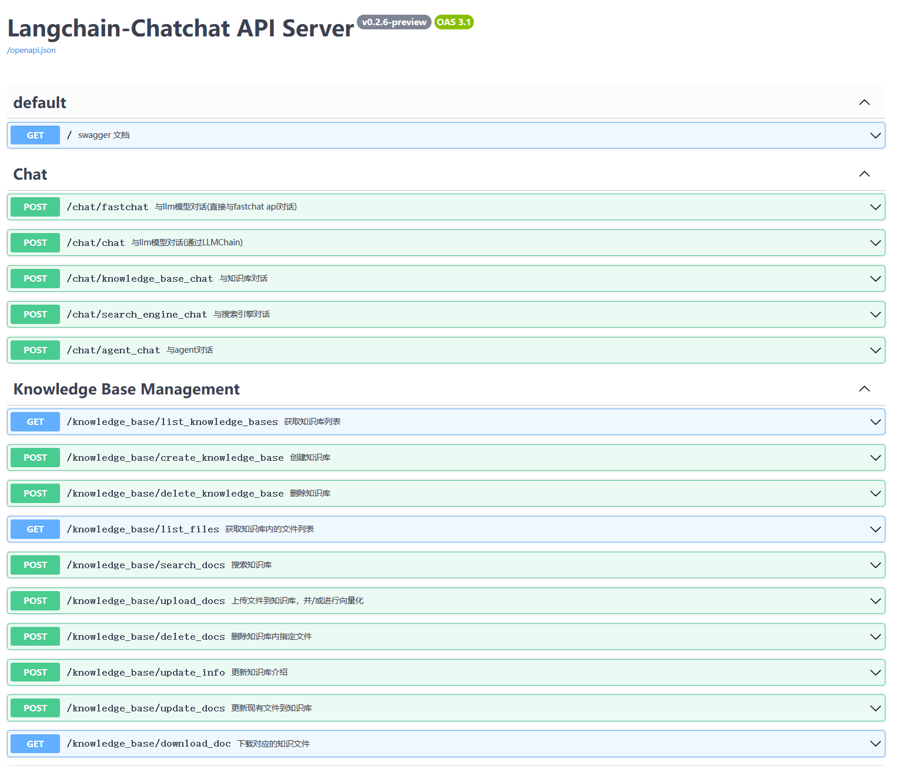

🌍 [中文文档](README.md)
🌍 [日本語で読む](README_ja.md)

📃 **LangChain-Chatchat** (formerly Langchain-ChatGLM):

A LLM application aims to implement knowledge and search engine based QA based on Langchain and open-source or remote
LLM API.

⚠️`0.2.10` will be the last version of the `0.2.x` series. The `0.2.x` series will stop updating and technical support,
and strive to develop `Langchain-Chachat 0.3.x` with stronger applicability.
Subsequent bug fixes for `0.2.10` will be pushed directly to the `master` branch without version updates.


---

## Table of Contents

- [Introduction](README.md#Introduction)
- [Pain Points Addressed](README.md#Pain-Points-Addressed)
- [Quick Start](README.md#Quick-Start)
    - [1. Environment Setup](README.md#1-Environment-Setup)
    - [2. Model Download](README.md#2-Model-Download)
    - [3. Initialize Knowledge Base and Configuration Files](README.md#3-Initialize-Knowledge-Base-and-Configuration-Files)
    - [4. One-Click Startup](README.md#4-One-Click-Startup)
    - [5. Startup Interface Examples](README.md#5-Startup-Interface-Examples)
- [Contact Us](README.md#Contact-Us)

## Introduction

🤖️ A Q&A application based on local knowledge base implemented using the idea
of [langchain](https://github.com/langchain-ai/langchain). The goal is to build a KBQA(Knowledge based Q&A) solution
that
is friendly to Chinese scenarios and open source models and can run both offline and online.

💡 Inspired by [document.ai](https://github.com/GanymedeNil/document.ai)
and [ChatGLM-6B Pull Request](https://github.com/THUDM/ChatGLM-6B/pull/216) , we build a local knowledge base question
answering application that can be implemented using an open source model or remote LLM api throughout the process. In
the latest version of this project, [FastChat](https://github.com/lm-sys/FastChat) is used to access Vicuna, Alpaca,
LLaMA, Koala, RWKV and many other models. Relying on [langchain](https://github.com/langchain-ai/langchain) , this
project supports calling services through the API provided based on [FastAPI](https://github.com/tiangolo/fastapi), or
using the WebUI based on [Streamlit](https://github.com/streamlit/streamlit).

✅ Relying on the open source LLM and Embedding models, this project can realize full-process **offline private
deployment**. At the same time, this project also supports the call of OpenAI GPT API- and Zhipu API, and will continue
to expand the access to various models and remote APIs in the future.

⛓️ The implementation principle of this project is shown in the graph below. The main process includes: loading files ->
reading text -> text segmentation -> text vectorization -> question vectorization -> matching the `top-k` most similar
to the question vector in the text vector -> The matched text is added to `prompt `as context and question -> submitte
to `LLM` to generate an answer.

📺[video introduction](https://www.bilibili.com/video/BV13M4y1e7cN/?share_source=copy_web&vd_source=e6c5aafe684f30fbe41925d61ca6d514)


The main process analysis from the aspect of document process:


🚩 The training or fine-tuning are not involved in the project, but still, one always can improve performance by do
these.

🌐 [AutoDL image](https://www.codewithgpu.com/i/chatchat-space/Langchain-Chatchat/Langchain-Chatchat) is supported, and in `0.2.10` the codes are update to v0.2.10.

🐳 [Docker image](registry.cn-beijing.aliyuncs.com/chatchat/chatchat:0.2.7) is supported to 0.2.7

## Pain Points Addressed

This project is a solution for enhancing knowledge bases with fully localized inference, specifically addressing the
pain points of data security and private deployments for businesses.
This open-source solution is under the Apache License and can be used for commercial purposes for free, with no fees
required.
We support mainstream local large prophecy models and Embedding models available in the market, as well as open-source
local vector databases. For a detailed list of supported models and databases, please refer to
our [Wiki](https://github.com/chatchat-space/Langchain-Chatchat/wiki/)

## Quick Start

### Environment Setup

First, make sure your machine has Python 3.10 installed.

```
$ python --version
Python 3.10.12
```

Then, create a virtual environment and install the project's dependencies within the virtual environment.

```shell

# 拉取仓库
$ git clone https://github.com/chatchat-space/Langchain-Chatchat.git

# 进入目录
$ cd Langchain-Chatchat

# 安装全部依赖
$ pip install -r requirements.txt 
$ pip install -r requirements_api.txt
$ pip install -r requirements_webui.txt  

# 默认依赖包括基本运行环境（FAISS向量库）。如果要使用 milvus/pg_vector 等向量库，请将 requirements.txt 中相应依赖取消注释再安装。
```

Please note that the LangChain-Chachat `0.2.x` series is for the Langchain `0.0.x` series version. If you are using the
Langchain `0.1.x` series version, you need to downgrade.

### Model Download

If you need to run this project locally or in an offline environment, you must first download the required models for
the project. Typically, open-source LLM and Embedding models can be downloaded from HuggingFace.

Taking the default LLM model used in this project, [THUDM/chatglm2-6b](https://huggingface.co/THUDM/chatglm2-6b), and
the Embedding model [moka-ai/m3e-base](https://huggingface.co/moka-ai/m3e-base) as examples:

To download the models, you need to first
install [Git LFS](https://docs.github.com/zh/repositories/working-with-files/managing-large-files/installing-git-large-file-storage)
and then run:

```Shell
$ git lfs install
$ git clone https://huggingface.co/THUDM/chatglm2-6b
$ git clone https://huggingface.co/moka-ai/m3e-base
```

### Initializing the Knowledge Base and Config File

Follow the steps below to initialize your own knowledge base and config file:

```shell
$ python copy_config_example.py
$ python init_database.py --recreate-vs
 ```

### One-Click Launch

To start the project, run the following command:

```shell
$ python startup.py -a
```

### Example of Launch Interface

1. FastAPI docs interface



2. webui page

- Web UI dialog page:


- Web UI knowledge base management page:


### Note

The above instructions are provided for a quick start. If you need more features or want to customize the launch method,
please refer to the [Wiki](https://github.com/chatchat-space/Langchain-Chatchat/wiki/).

---

## Project Milestones

+ `April 2023`: `Langchain-ChatGLM 0.1.0` released, supporting local knowledge base question and answer based on the
  ChatGLM-6B model.
+ `August 2023`: `Langchain-ChatGLM` was renamed to `Langchain-Chatchat`, `0.2.0` was released, using `fastchat` as the
  model loading solution, supporting more models and databases.
+ `October 2023`: `Langchain-Chachat 0.2.5` was released, Agent content was launched, and the open source project won
  the third prize in the hackathon held by `Founder Park & Zhipu AI & Zilliz`.
+ `December 2023`: `Langchain-Chachat` open source project received more than **20K** stars.
+ `January 2024`: `LangChain 0.1.x` is launched, `Langchain-Chachat 0.2.x` is released. After the stable
  version `0.2.10` is released, updates and technical support will be stopped, and all efforts will be made to
  develop `Langchain with stronger applicability -Chat 0.3.x`.


+ 🔥 Let’s look forward to the future Chatchat stories together···

---

## Contact Us

### Telegram

[](https://t.me/+RjliQ3jnJ1YyN2E9)

### WeChat Group


### WeChat Official Account


