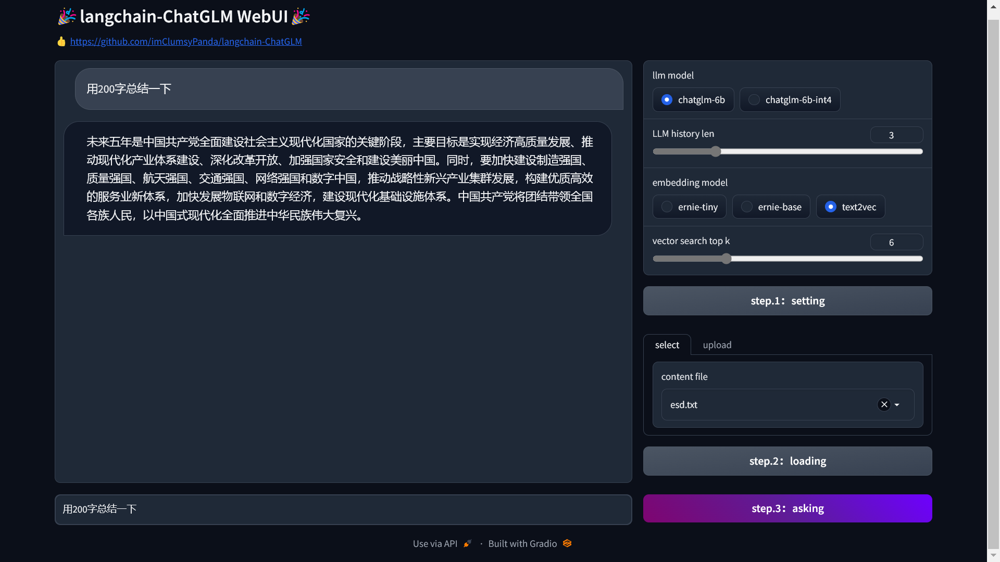
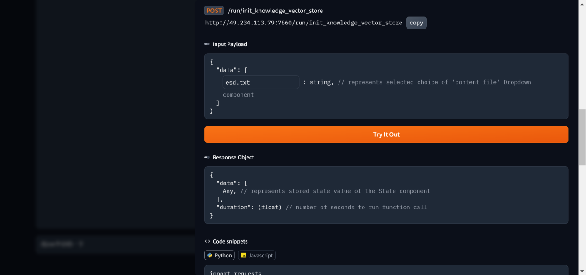

# ChatGLM Application Based on Local Knowledge

## Introduction

🌍 [_中文文档_](README.md)

🤖️ A local knowledge based LLM Application with [ChatGLM-6B](https://github.com/THUDM/ChatGLM-6B) and [langchain](https://github.com/hwchase17/langchain).

💡 Inspired by [document.ai](https://github.com/GanymedeNil/document.ai) by [GanymedeNil](https://github.com/GanymedeNil) and [ChatGLM-6B Pull Request](https://github.com/THUDM/ChatGLM-6B/pull/216) by [AlexZhangji](https://github.com/AlexZhangji).

✅ In this project, [GanymedeNil/text2vec-large-chinese](https://huggingface.co/GanymedeNil/text2vec-large-chinese/tree/main) is used as Embedding Model，and [ChatGLM-6B](https://github.com/THUDM/ChatGLM-6B) used as LLM。Based on those models，this project can be deployed **offline** with all **open source** models。

## Webui 

Click on steps 1-3 according to the above figure to complete the model loading, file loading, and viewing of dialogue history


Click on the Use via API at the bottom to view the API interface. Existing applications can be docked and called through post requests

### TODO
-[] Add Model Load progress bar
-[] Add output content and error prompts
-[] International language switching
-[] Reference annotation
-[] Add plugin system (can be used for basic LORA training, etc.)

## Update

**[2023/04/11]** 
1. Add Webui V0.1 version and synchronize the updated content before the current day;
2. Automatically read knowledge_ based_ Enumerate LLM and embedding models in chatglm.py, select and click 'setting' to load the model. You can switch models for testing at any time
3. The length of the conversation history can be manually adjusted and can be adjusted according to the size of the video memory
4. Add the upload file function, select the uploaded file from the dropdown box, click loading to load the file, and the loaded file can be changed at any time during the process
5. Add use via API at the bottom to connect to your own system

**[2023/04/07]**
1. Fix bug which costs twice gpu memory (Thanks to [@suc16](https://github.com/suc16) and [@myml](https://github.com/myml)).
2. Add gpu memory clear function after each call of ChatGLM.
3. Add `nghuyong/ernie-3.0-nano-zh` and `nghuyong/ernie-3.0-base-zh` as Embedding model alternatives，costing less gpu than `GanymedeNil/text2vec-large-chinese` (Thanks to [@lastrei](https://github.com/lastrei))

**[2023/04/09]**
1. Using `RetrievalQA` in `langchain` to replace the previously selected `ChatVectorDBChain`, the replacement can effectively solve the problem of program stopping after 2-3 questions due to insufficient gpu memory.
2. Add `EMBEDDING_MODEL`, `VECTOR_SEARCH_TOP_K`, `LLM_MODEL`, `LLM_HISTORY_LEN`, `REPLY_WITH_SOURCE` parameter value settings in `knowledge_based_chatglm.py`.
3. Add `chatglm-6b-int4`, `chatglm-6b-int4-qe` with smaller GPU memory requirements as LLM model alternatives.
4. Correct code errors in `README.md` (Thanks to [@calcitem](https://github.com/calcitem)).

## Usage

### Hardware Requirements

- ChatGLM Hardware Requirements

    | **Quantization Level** | **GPU Memory** |
    |------------------------|----------------|
    | FP16（no quantization）  | 13 GB          |
    | INT8                   | 10 GB          |
    | INT4                   | 6 GB           |
- Embedding Hardware Requirements

   The default Embedding model in this repo is [GanymedeNil/text2vec-large-chinese](https://huggingface.co/GanymedeNil/text2vec-large-chinese/tree/main), 3GB GPU Memory required when running on GPU.

### Software Requirements
This repo has been tested in python 3.8 environment。

### 1. install python packages
```commandline
pip install -r requirements.txt
```
Attention: With langchain.document_loaders.UnstructuredFileLoader used to connect with local knowledge file, you may need some other dependencies as mentioned in  [langchain documentation](https://python.langchain.com/en/latest/modules/indexes/document_loaders/examples/unstructured_file.html)

### 2. Run [knowledge_based_chatglm.py](knowledge_based_chatglm.py) script
```commandline
python knowledge_based_chatglm.py
```

### Known issues
- Currently tested to support txt, docx, md format files, for more file formats please refer to [langchain documentation](https://python.langchain.com/en/latest/modules/indexes/document_loaders/examples/unstructured_file.html). If the document contains special characters, the file may not be correctly loaded.
- When running this project with macOS, it may not work properly due to incompatibility with pytorch caused by macOS version 13.3 and above.

### FAQ

Q: How to solve `Resource punkt not found.`?

A: Unzip `packages/tokenizers` in https://github.com/nltk/nltk_data/raw/gh-pages/packages/tokenizers/punkt.zip and put it in the corresponding directory of `Searched in:`.

Q: How to solve `Resource averaged_perceptron_tagger not found.`?

A: Download https://github.com/nltk/nltk_data/blob/gh-pages/packages/taggers/averaged_perceptron_tagger.zip, decompress it and put it in the corresponding directory of `Searched in:`.

## Roadmap

- [x] local knowledge based application with langchain + ChatGLM-6B
- [x] unstructured files loaded with langchain
- [ ] more different file format loaded with langchain
- [ ] implement web ui DEMO with gradio/streamlit 
- [ ] implement API with fastapi，and web ui DEMO with API

