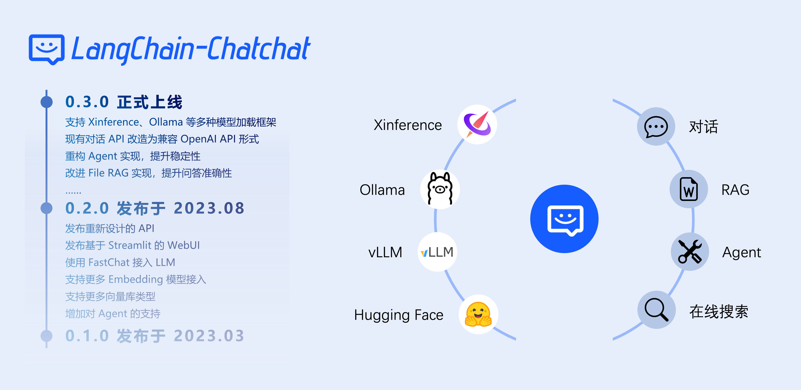
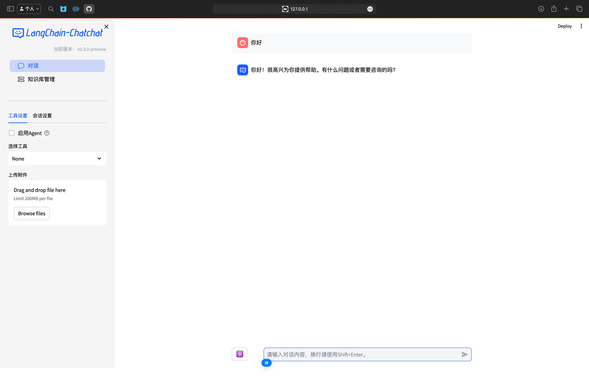

🌍 [READ THIS IN CHINESE](README.md)

📃 **LangChain-Chatchat** (formerly Langchain-ChatGLM)

An open-source, offline-deployable RAG and Agent application project based on large language models like ChatGLM and
application frameworks like Langchain.

---

## Contents

* [Overview](README_en.md#Overview)
* [Features](README_en.md#What-Does-Langchain-Chatchat-Offer)
* [Quick Start](README_en.md#Quick-Start)
    * [Installation](README_en.md#Installation)
* [Contact Us](README_en.md#Contact-Us)

## Overview

🤖️ A question-answering application based on local knowledge bases using
the [langchain](https://github.com/langchain-ai/langchain) concept. The goal is to create a friendly and
offline-operable knowledge base Q&A solution that supports Chinese scenarios and open-source models.

💡 Inspired by [GanymedeNil](https://github.com/GanymedeNil)'s
project [document.ai](https://github.com/GanymedeNil/document.ai) and [AlexZhangji](https://github.com/AlexZhangji)'
s [ChatGLM-6B Pull Request](https://github.com/THUDM/ChatGLM-6B/pull/216), this project aims to establish a local
knowledge base Q&A application fully utilizing open-source models. The latest version of the project
uses [FastChat](https://github.com/lm-sys/FastChat) to integrate models like Vicuna, Alpaca, LLaMA, Koala, and RWKV,
leveraging the [langchain](https://github.com/langchain-ai/langchain) framework to support API calls provided
by [FastAPI](https://github.com/tiangolo/fastapi) or operations using a WebUI based
on [Streamlit](https://github.com/streamlit/streamlit).



✅ This project supports mainstream open-source LLMs, embedding models, and vector databases, allowing full **open-source
** model **offline private deployment**. Additionally, the project supports OpenAI GPT API
calls and will continue to expand access to various models and model APIs.

⛓️ The implementation principle of this project is as shown below, including loading files -> reading text -> text
segmentation -> text vectorization -> question vectorization -> matching the `top k` most similar text vectors with the
question vector -> adding the matched text as context along with the question to the `prompt` -> submitting to the `LLM`
for generating answers.

📺 [Introduction Video](https://www.bilibili.com/video/BV13M4y1e7cN/?share_source=copy_web&vd_source=e6c5aafe684f30fbe41925d61ca6d514)


From the document processing perspective, the implementation process is as follows:


🚩 This project does not involve fine-tuning or training processes but can utilize fine-tuning or training to optimize
the project's performance.

🌐 The `0.3.0` version code used in
the [AutoDL Mirror](https://www.codewithgpu.com/i/chatchat-space/Langchain-Chatchat/Langchain-Chatchat) has been updated
to version `v0.3.0` of this project.

🐳 Docker images will be updated soon.

🧑‍💻 If you want to contribute to this project, please refer to the [Developer Guide](docs/contributing/README_dev.md)
for more information on development and deployment.

## What Does Langchain-Chatchat Offer

### Features of Version 0.3.x

| Features                        | 0.2.x                                     | 0.3.x                                                                                                                                                   |
|---------------------------------|-------------------------------------------|---------------------------------------------------------------------------------------------------------------------------------------------------------|
| Model Integration               | Local: fastchat<br>Online: XXXModelWorker | Local: model_provider, supports most mainstream model loading frameworks<br>Online: oneapi<br>All model integrations are compatible with the openai sdk |
| Agent                           | ❌ Unstable                                | ✅ Optimized for ChatGLM3 and QWen, significantly enhanced Agent capabilities                                                                            ||
| LLM Conversations               | ✅                                         | ✅                                                                                                                                                       ||
| Knowledge Base Conversations    | ✅                                         | ✅                                                                                                                                                       ||
| Search Engine Conversations     | ✅                                         | ✅                                                                                                                                                       ||
| File Conversations              | ✅ Only vector search                      | ✅ Unified as File RAG feature, supports BM25+KNN and other retrieval methods                                                                            ||
| Database Conversations          | ❌                                         | ✅                                                                                                                                                       ||
| ARXIV Document Conversations    | ❌                                         | ✅                                                                                                                                                       ||
| Wolfram Conversations           | ❌                                         | ✅                                                                                                                                                       ||
| Text-to-Image                   | ❌                                         | ✅                                                                                                                                                       ||
| Local Knowledge Base Management | ✅                                         | ✅                                                                                                                                                       ||
| WEBUI                           | ✅                                         | ✅ Better multi-session support, custom system prompts...                                                                                                |

The core functionality of 0.3.x is implemented by Agent, but users can also manually perform tool calls:
|Operation Method|Function Implemented|Applicable Scenario|
|----------------|--------------------|-------------------|
|Select "Enable Agent", choose multiple tools|Automatic tool calls by LLM|Using models with Agent capabilities like
ChatGLM3/Qwen or online APIs|
|Select "Enable Agent", choose a single tool|LLM only parses tool parameters|Using models with general Agent
capabilities, unable to choose tools well<br>Want to manually select functions|
|Do not select "Enable Agent", choose a single tool|Manually fill in parameters for tool calls without using Agent
function|Using models without Agent capabilities|

More features and updates can be experienced in the actual deployment.

### Supported Model Deployment Frameworks and Models

This project already supports mainstream models on the market, such as [GLM-4-Chat](https://github.com/THUDM/GLM-4)
and [Qwen2-Instruct](https://github.com/QwenLM/Qwen2), among the latest open-source large language models and embedding
models. Users need to start the model deployment framework and load the required models by modifying the configuration
information. The supported local model deployment frameworks in this project are as follows:

| Model Deployment Framework         | Xinference                                                                                          | LocalAI                                                               | Ollama                                                                                    | FastChat                                                                                        |
|------------------------------------|-----------------------------------------------------------------------------------------------------|-----------------------------------------------------------------------|-------------------------------------------------------------------------------------------|-------------------------------------------------------------------------------------------------|
| Aligned with OpenAI API            | ✅                                                                                                   | ✅                                                                     | ✅                                                                                         | ✅                                                                                               |
| Accelerated Inference Engine       | GPTQ, GGML, vLLM, TensorRT                                                                          | GPTQ, GGML, vLLM, TensorRT                                            | GGUF, GGML                                                                                | vLLM                                                                                            |
| Model Types Supported              | LLM, Embedding, Rerank, Text-to-Image, Vision, Audio                                                | LLM, Embedding, Rerank, Text-to-Image, Vision, Audio                  | LLM, Text-to-Image, Vision                                                                | LLM, Vision                                                                                     |
| Function Call                      | ✅                                                                                                   | ✅                                                                     | ✅                                                                                         | /                                                                                               |
| More Platform Support (CPU, Metal) | ✅                                                                                                   | ✅                                                                     | ✅                                                                                         | ✅                                                                                               |
| Heterogeneous                      | ✅                                                                                                   | ✅                                                                     | /                                                                                         | /                                                                                               |
| Cluster                            | ✅                                                                                                   | ✅                                                                     | /                                                                                         | /                                                                                               |
| Documentation Link                 | [Xinference Documentation](https://inference.readthedocs.io/zh-cn/latest/models/builtin/index.html) | [LocalAI Documentation](https://localai.io/model-compatibility/)      | [Ollama Documentation](https://github.com/ollama/ollama?tab=readme-ov-file#model-library) | [FastChat Documentation](https://github.com/lm-sys/FastChat#install)                            |
| Available Models                   | [Xinference Supported Models](https://inference.readthedocs.io/en/latest/models/builtin/index.html) | [LocalAI Supported Models](https://localai.io/model-compatibility/#/) | [Ollama Supported Models](https://ollama.com/library#)                                    | [FastChat Supported Models](https://github.com/lm-sys/FastChat/blob/main/docs/model_support.md) |

In addition to the above local model loading frameworks, the project also supports
the [One API](https://github.com/songquanpeng/one-api) framework for integrating online APIs, supporting commonly used
online APIs such
as [OpenAI ChatGPT](https://platform.openai.com/docs/guides/gpt/chat-completions-api), [Azure OpenAI API](https://learn.microsoft.com/en-us/azure/ai-services/openai/reference), [Anthropic Claude](https://anthropic.com/), [Zhipu Qingyan](https://bigmodel.cn/),
and [Baichuan](https://platform.baichuan-ai.com/).

> [!Note]
> Regarding Xinference loading local models:
> Xinference built-in models will automatically download. To load locally downloaded models, you can
> execute `streamlit run xinference_manager.py` in the tools/model_loaders directory of the project after starting the
> Xinference service and set the local path for the specified model as prompted on the page.

## Quick Start

### Installation

#### 0. Software and Hardware Requirements

💡 On the software side, this project supports Python 3.8-3.11 environments and has been tested on Windows, macOS, and
Linux operating systems.

💻 On the hardware side, as version 0.3.0 has been modified to support integration with different model deployment
frameworks, it can be used under various hardware conditions such as CPU, GPU, NPU, and MPS.

#### 1. Install Langchain-Chatchat

Starting from version 0.3.0, Langchain-Chatchat provides installation in the form of a Python library. Execute the
following command for installation:

```shell
pip install langchain-chatchat -U
```

[!Note]
> Since the model deployment framework Xinference requires additional Python dependencies when integrated with
> Langchain-Chatchat, it is recommended to use the following installation method if you want to use it with the
> Xinference
> framework:
> ```shell
> pip install langchain-chatchat[xinference] -U
> ```

2. Model Inference Framework and Load Models

2. Model Inference Framework and Load Models

Starting from version 0.3.0, Langchain-Chatchat no longer directly loads models based on the local model path entered by
users. The involved model types include LLM, Embedding, Reranker, and the multi-modal models to be supported in the
future. Instead, it supports integration with mainstream model inference frameworks such
as [Xinference](https://github.com/xorbitsai/inference), [Ollama](https://github.com/ollama/ollama), [LocalAI](https://github.com/mudler/LocalAI), [FastChat](https://github.com/lm-sys/FastChat)
and [One API](https://github.com/songquanpeng/one-api).

Therefore, please ensure to run the model inference framework and load the required models before starting
Langchain-Chatchat.

Here is an example of Xinference. Please refer to
the [Xinference Document](https://inference.readthedocs.io/zh-cn/latest/getting_started/installation.html) for framework
deployment and model loading.

> [!WARNING]  
> To avoid dependency conflicts, place Langchain-Chatchat and model deployment frameworks like Xinference in different
> Python virtual environments, such as conda, venv, virtualenv, etc.

#### 3. View and Modify Langchain-Chatchat Configuration

Starting from version 0.3.0, Langchain-Chatchat no longer modifies the configuration through local files but uses
command-line methods and will add configuration item modification pages in future versions.

The following introduces how to view and modify the configuration.

##### 3.1 View chatchat-config Command Help

Enter the following command to view the optional configuration types:

```shell
chatchat-config --help
```

You will get the following response:

```text 
Usage: chatchat-config [OPTIONS] COMMAND [ARGS]...

  指令` chatchat-config` 工作空间配置

Options:
  --help  Show this message and exit.

Commands:
  basic   基础配置
  kb      知识库配置
  model   模型配置
  server  服务配置
```

You can choose the required configuration type based on the above commands. For example, to view or
modify `basic configuration`, you can enter the following command to get help information:

```shell
chatchat-config basic --help
```

You will get the following response:

```text
Usage: chatchat-config basic [OPTIONS]

  基础配置

Options:
  --verbose [true|false]  是否开启详细日志
  --data TEXT             初始化数据存放路径，注意：目录会清空重建
  --format TEXT           日志格式
  --clear                 清除配置
  --show                  显示配置
  --help                  Show this message and exit.
```

##### 3.2 Use chatchat-config to Modify Corresponding Configuration Parameters

To modify the `default llm` model in `model configuration`, you can execute the following command to view the
configuration item names:

```shell
chatchat-config basic --show
```

If no configuration item modification is made, the default configuration is as follows:

```text 
{
    "log_verbose": false,
    "CHATCHAT_ROOT": "/root/anaconda3/envs/chatchat/lib/python3.11/site-packages/chatchat",
    "DATA_PATH": "/root/anaconda3/envs/chatchat/lib/python3.11/site-packages/chatchat/data",
    "IMG_DIR": "/root/anaconda3/envs/chatchat/lib/python3.11/site-packages/chatchat/img",
    "NLTK_DATA_PATH": "/root/anaconda3/envs/chatchat/lib/python3.11/site-packages/chatchat/data/nltk_data",
    "LOG_FORMAT": "%(asctime)s - %(filename)s[line:%(lineno)d] - %(levelname)s: %(message)s",
    "LOG_PATH": "/root/anaconda3/envs/chatchat/lib/python3.11/site-packages/chatchat/data/logs",
    "MEDIA_PATH": "/root/anaconda3/envs/chatchat/lib/python3.11/site-packages/chatchat/data/media",
    "BASE_TEMP_DIR": "/root/anaconda3/envs/chatchat/lib/python3.11/site-packages/chatchat/data/temp",
    "class_name": "ConfigBasic"
}
```

##### 3.3 Use chatchat-config to Modify Corresponding Configuration Parameters

To modify the default `llm model` in `model configuration`, you can execute the following command to view the
configuration item names:

```shell
chatchat-config model --help
```

You will get:

```text 
Usage: chatchat-config model [OPTIONS]

  模型配置

Options:
  --default_llm_model TEXT        默认llm模型
  --default_embedding_model TEXT  默认embedding模型
  --agent_model TEXT              agent模型
  --history_len INTEGER           历史长度
  --max_tokens INTEGER            最大tokens
  --temperature FLOAT             温度
  --support_agent_models TEXT     支持的agent模型
  --model_providers_cfg_path_config TEXT
                                  模型平台配置文件路径
  --model_providers_cfg_host TEXT
                                  模型平台配置服务host
  --model_providers_cfg_port INTEGER
                                  模型平台配置服务port
  --set_model_platforms TEXT      模型平台配置 as a JSON string.
  --set_tool_config TEXT          工具配置项  as a JSON string.
  --clear                         清除配置
  --show                          显示配置
  --help                          Show this message and exit.
```

First, view the current `model configuration` parameters:

```shell
chatchat-config model --show
```

You will get:

```text 
{
    "DEFAULT_LLM_MODEL": "glm4-chat",
    "DEFAULT_EMBEDDING_MODEL": "bge-large-zh-v1.5",
    "Agent_MODEL": null,
    "HISTORY_LEN": 3,
    "MAX_TOKENS": null,
    "TEMPERATURE": 0.7,
    ...
    "class_name": "ConfigModel"
}
```

To modify the `default llm` model to `qwen2-instruct`, execute:

```shell
chatchat-config model --default_llm_model qwen2-instruct
```

For more configuration modification help, refer to  [README.md](libs/chatchat-server/README.md)

4. Custom Model Integration Configuration

After completing the above project configuration item viewing and modification, proceed to step 2. Model Inference
Framework and Load Models and select the model inference framework and loaded models. Model inference frameworks include
[Xinference](https://github.com/xorbitsai/inference),[Ollama](https://github.com/ollama/ollama),[LocalAI](https://github.com/mudler/LocalAI),[FastChat](https://github.com/lm-sys/FastChat)
and [One API](https://github.com/songquanpeng/one-api), supporting new Chinese open-source models
like [GLM-4-Chat](https://github.com/THUDM/GLM-4) and [Qwen2-Instruct](https://github.com/QwenLM/Qwen2)

Refer to the `model_providers.yaml` file in the configs directory pointed by the `CHATCHAT_ROOT` variable in step 3.2 to
complete the custom platform loading.

```shell
# Here should be the directory pointed by the "CHATCHAT_ROOT" variable in step 3.2
cd /root/anaconda3/envs/chatchat/lib/python3.11/site-packages/chatchat
vim model_providers.yaml
```

Refer to [model-providers/README.md](libs/model-providers/README_en.md) for configuration instructions.

Refer to [model_providers.yaml](libs/model-providers/model_providers.yaml) for detailed configuration.

#### 5. Initialize Knowledge Base

> [!WARNING]
> Before initializing the knowledge base, ensure that the model inference framework and corresponding embedding model
> are
> running, and complete the model integration configuration as described in steps 3 and 4.

```shell
cd # Return to the original directory
chatchat-kb -r
```

Specify text-embedding model for initialization (if needed):

```
cd # Return to the original directory
chatchat-kb -r --embed-model=text-embedding-3-smal
```

Successful output will be:

```text 

----------------------------------------------------------------------------------------------------
知识库名称      ：samples
知识库类型      ：faiss
向量模型：      ：bge-large-zh-v1.5
知识库路径      ：/root/anaconda3/envs/chatchat/lib/python3.11/site-packages/chatchat/data/knowledge_base/samples
文件总数量      ：47
入库文件数      ：42
知识条目数      ：740
用时            ：0:02:29.701002
----------------------------------------------------------------------------------------------------

总计用时        ：0:02:33.414425

2024-06-17 22:30:47,933 - init_database.py[line:176] - WARNING: Sending SIGKILL to <Process name='Model providers Server (3949160)' pid=3949160 parent=3949098 started daemon>
```

The knowledge base path is in the knowledge_base directory under the path pointed by the *DATA_PATH* variable in
step `3.2`:

```shell
(chatchat) [root@VM-centos ~]#  ls /root/anaconda3/envs/chatchat/lib/python3.11/site-packages/chatchat/data/knowledge_base/samples/vector_store
bge-large-zh-v1.5  text-embedding-3-small
```

#### 6. Start the Project

```shell
chatchat -a
```

Successful startup output:



> [!WARNING]
> As the `DEFAULT_BIND_HOST` of the chatchat-config server configuration is set to `127.0.0.1` by default, it cannot be
> accessed through other IPs.
>
> To modify, refer to the following method:
> <details>
> <summary>Instructions</summary>
>
> ```shell
> chatchat-config server --show
> ```
> You will get:
> ```text 
> {
>     "HTTPX_DEFAULT_TIMEOUT": 300.0,
>     "OPEN_CROSS_DOMAIN": true,
>     "DEFAULT_BIND_HOST": "127.0.0.1",
>     "WEBUI_SERVER_PORT": 8501,
>     "API_SERVER_PORT": 7861,
>     "WEBUI_SERVER": {
>         "host": "127.0.0.1",
>         "port": 8501
>     },
>     "API_SERVER": {
>         "host": "127.0.0.1",
>         "port": 7861
>     },
>     "class_name": "ConfigServer"
> }
> ```
> To access via the machine's IP (such as in a Linux system), change the listening address to `0.0.0.0`.
> ```shell
> chatchat-config server --default_bind_host=0.0.0.0
> ```
> You will get:
> ```text 
> {
>     "HTTPX_DEFAULT_TIMEOUT": 300.0,
>     "OPEN_CROSS_DOMAIN": true,
>     "DEFAULT_BIND_HOST": "0.0.0.0",
>     "WEBUI_SERVER_PORT": 8501,
>     "API_SERVER_PORT": 7861,
>     "WEBUI_SERVER": {
>         "host": "0.0.0.0",
>         "port": 8501
>     },
>     "API_SERVER": {
>         "host": "0.0.0.0",
>         "port": 7861
>     },
>     "class_name": "ConfigServer"
> }
> ```
> </details>


### Migration from Older Versions

* The structure of 0.3.x has changed significantly, it is strongly recommended to redeploy according to the documentation.
The following guide does not guarantee 100% compatibility and success. Remember to backup important data in advance!

- First configure the operating environment according to the steps in `Installation`.
- Configure `DATA` and other options.
- Copy the knowledge_base directory of the 0.2.x project to the configured `DATA` directory.

---

## License

The code of this project that does not involve *Additional License*  follows the [Apache-2.0](LICENSE) agreement.

### Additional License

The [model-providers code](https://github.com/chatchat-space/Langchain-Chatchat/tree/master/libs/model-providers/) in this repository
references the relevant code in [Dify](https://github.com/langgenius/dify/tree/main/api/core/model_runtime).
If you use this part of the code and redistribute it, you need to include the full content of [ADDITIONAL_LICENSE](ADDITIONAL_LICENSE).
## Project Milestones

+ `April 2023`: `Langchain-ChatGLM 0.1.0` released, supporting local knowledge base question and answer based on ChatGLM-6B model.
+ `August 2023`: `Langchain-ChatGLM` renamed to `Langchain-Chatchat`, released `0.2.0` version, using `fastchat` as model loading solution, supporting more models and databases.
+ `October 2023`: `Langchain-Chatchat 0.2.5` released, launching Agent content, open source project won the third prize in the hackathon held by `Founder Park & ​​Zhipu AI & Zilliz`.
+ `December 2023`: `Langchain-Chatchat` open source project received more than **20K** stars.
+ `June 2024`: `Langchain-Chatchat 0.3.0` released, bringing a new project architecture.

+ 🔥 Let us look forward to the future story of Chatchat ···

## Contact Us

### Telegram

[](https://t.me/+RjliQ3jnJ1YyN2E9)

### Project Exchange Group


🎉 Langchain-Chatchat project WeChat exchange group, if you are also interested in this project, welcome to join the group chat to participate in the discussion.

### Official Account


🎉 Langchain-Chatchat project official public account, welcome to scan the code to follow.
