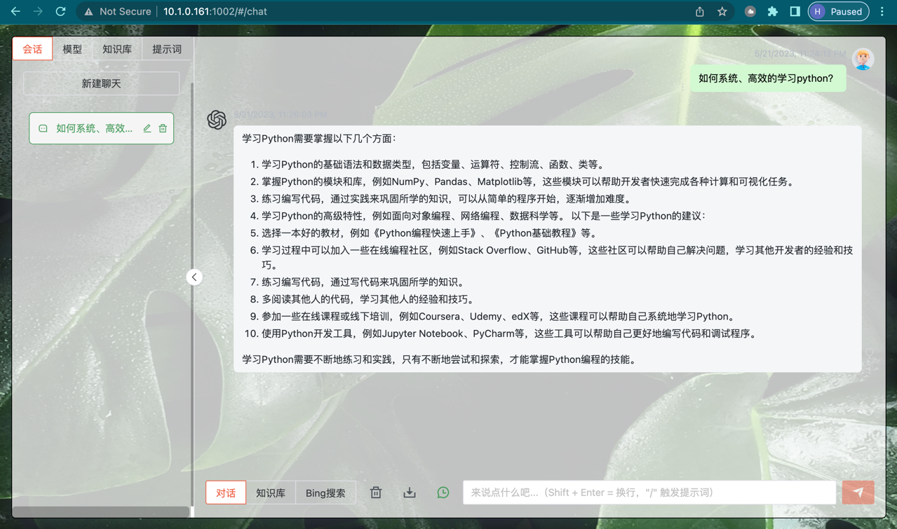
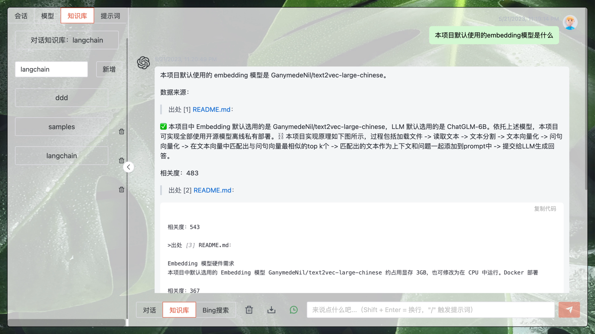
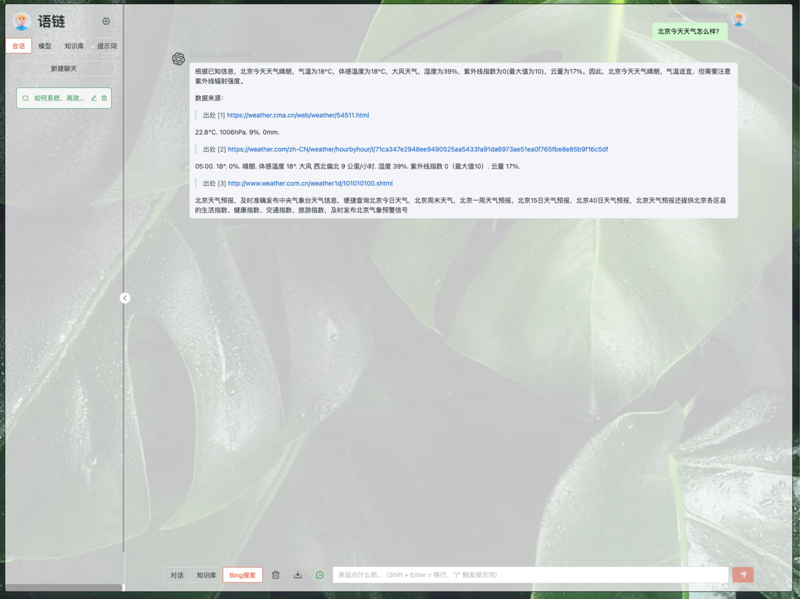
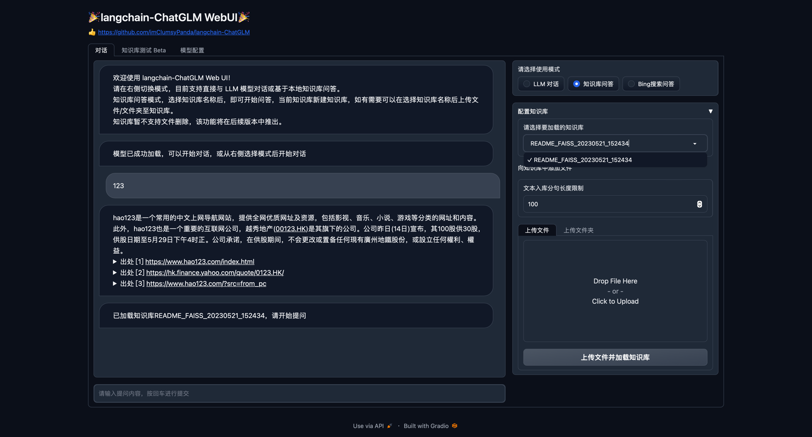
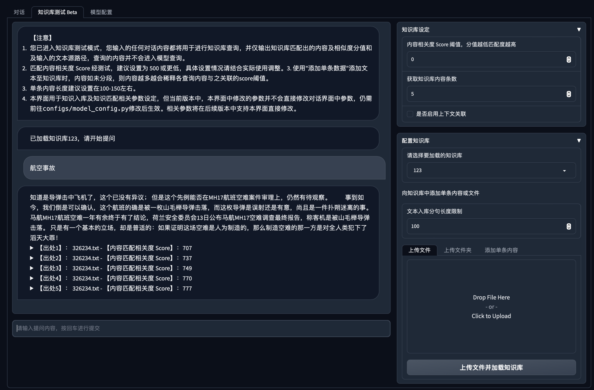

# ChatGLM Application with Local Knowledge Implementation

## Introduction

[](https://t.me/+RjliQ3jnJ1YyN2E9)

🌍 [_中文文档_](README.md)

🤖️ This is a ChatGLM application based on local knowledge, implemented using [ChatGLM-6B](https://github.com/THUDM/ChatGLM-6B) and [langchain](https://github.com/hwchase17/langchain).

💡 Inspired by [document.ai](https://github.com/GanymedeNil/document.ai) and [Alex Zhangji](https://github.com/AlexZhangji)'s [ChatGLM-6B Pull Request](https://github.com/THUDM/ChatGLM-6B/pull/216), this project establishes a local knowledge question-answering application using open-source models.

✅ The embeddings used in this project are [GanymedeNil/text2vec-large-chinese](https://huggingface.co/GanymedeNil/text2vec-large-chinese/tree/main), and the LLM is [ChatGLM-6B](https://github.com/THUDM/ChatGLM-6B). Relying on these models, this project enables the use of **open-source** models for **offline private deployment**.

⛓️ The implementation principle of this project is illustrated in the figure below. The process includes loading files -> reading text -> text segmentation -> text vectorization -> question vectorization -> matching the top k most similar text vectors to the question vector -> adding the matched text to `prompt` along with the question as context -> submitting to `LLM` to generate an answer.


🚩 This project does not involve fine-tuning or training; however, fine-tuning or training can be employed to optimize the effectiveness of this project.

📓 [ModelWhale online notebook](https://www.heywhale.com/mw/project/643977aa446c45f4592a1e59)

## Changelog

**[2023/04/15]**

   1. refactor the project structure to keep the command line demo [cli_demo.py](cli_demo.py) and the Web UI demo [webui.py](webui.py) in the root directory.
   2. Improve the Web UI by modifying it to first load the model according to the default option of [configs/model_config.py](configs/model_config.py) after running the Web UI, and adding error messages, etc.
   3. Update FAQ.

**[2023/04/12]**

   1. Replaced the sample files in the Web UI to avoid issues with unreadable files due to encoding problems in Ubuntu;
   2. Replaced the prompt template in `knowledge_based_chatglm.py` to prevent confusion in the content returned by ChatGLM, which may arise from the prompt template containing Chinese and English bilingual text.

**[2023/04/11]**

   1. Added Web UI V0.1 version (thanks to [@liangtongt](https://github.com/liangtongt));
   2. Added Frequently Asked Questions in `README.md` (thanks to [@calcitem](https://github.com/calcitem) and [@bolongliu](https://github.com/bolongliu));
   3. Enhanced automatic detection for the availability of `cuda`, `mps`, and `cpu` for LLM and Embedding model running devices;
   4. Added a check for `filepath` in `knowledge_based_chatglm.py`. In addition to supporting single file import, it now supports a single folder path as input. After input, it will traverse each file in the folder and display a command-line message indicating the success of each file load.

5. **[2023/04/09]**

   1. Replaced the previously selected `ChatVectorDBChain` with `RetrievalQA` in `langchain`, effectively reducing the issue of stopping due to insufficient video memory after asking 2-3 times;
   2. Added `EMBEDDING_MODEL`, `VECTOR_SEARCH_TOP_K`, `LLM_MODEL`, `LLM_HISTORY_LEN`, `REPLY_WITH_SOURCE` parameter value settings in `knowledge_based_chatglm.py`;
   3. Added `chatglm-6b-int4` and `chatglm-6b-int4-qe`, which require less GPU memory, as LLM model options;
   4. Corrected code errors in `README.md` (thanks to [@calcitem](https://github.com/calcitem)).

**[2023/04/07]**

   1. Resolved the issue of doubled video memory usage when loading the ChatGLM model (thanks to [@suc16](https://github.com/suc16) and [@myml](https://github.com/myml));
   2. Added a mechanism to clear video memory;
   3. Added `nghuyong/ernie-3.0-nano-zh` and `nghuyong/ernie-3.0-base-zh` as Embedding model options, which consume less video memory resources than `GanymedeNil/text2vec-large-chinese` (thanks to [@lastrei](https://github.com/lastrei)).

## How to Use

### Hardware Requirements

- ChatGLM-6B Model Hardware Requirements
  
     | **Quantization Level** | **Minimum GPU Memory** (inference) | **Minimum GPU Memory** (efficient parameter fine-tuning) |
     | -------------- | ------------------------- | --------------------------------- |
     | FP16 (no quantization) | 13 GB | 14 GB |
     | INT8 | 8 GB | 9 GB |
     | INT4 | 6 GB | 7 GB |

- Embedding Model Hardware Requirements

     The default Embedding model [GanymedeNil/text2vec-large-chinese](https://huggingface.co/GanymedeNil/text2vec-large-chinese/tree/main) in this project occupies around 3GB of video memory and can also be configured to run on a CPU.
### Software Requirements

This repository has been tested with Python 3.8 and CUDA 11.7 environments.

### 1. Setting up the environment

* Environment check

```shell
# First, make sure your machine has Python 3.8 or higher installed
$ python --version
Python 3.8.13

# If your version is lower, you can use conda to install the environment
$ conda create -p /your_path/env_name python=3.8

# Activate the environment
$ source activate /your_path/env_name

# Deactivate the environment
$ source deactivate /your_path/env_name

# Remove the environment
$ conda env remove -p  /your_path/env_name
```

* Project dependencies

```shell

# Clone the repository
$ git clone https://github.com/imClumsyPanda/langchain-ChatGLM.git

# Install dependencies
$ pip install -r requirements.txt
```

Note: When using langchain.document_loaders.UnstructuredFileLoader for unstructured file integration, you may need to install other dependency packages according to the documentation. Please refer to [langchain documentation](https://python.langchain.com/en/latest/modules/indexes/document_loaders/examples/unstructured_file.html).

### 2. Run Scripts to Experience Web UI or Command Line Interaction

Execute [webui.py](webui.py) script to experience **Web interaction** 
```commandline
python webui.py

```
Or execute [api.py](api.py) script to deploy web api.
```shell
$ python api.py
```
Note: Before executing, check the remaining space in the `$HOME/.cache/huggingface/` folder, at least 15G.

Or execute following command to run VUE after api.py executed
```shell
$ cd views 

$ pnpm i

$ npm run dev
```

VUE interface screenshots:







Web UI interface screenshots:






The Web UI supports the following features:

1. Automatically reads the `LLM` and `embedding` model enumerations in `configs/model_config.py`, allowing you to select and reload the model by clicking `重新加载模型`.
2. The length of retained dialogue history can be manually adjusted according to the available video memory.
3. Adds a file upload function. Select the uploaded file through the drop-down box, click `加载文件` to load the file, and change the loaded file at any time during the process.

Alternatively, execute the [knowledge_based_chatglm.py](https://chat.openai.com/chat/cli_demo.py) script to experience **command line interaction**:

```commandline
python knowledge_based_chatglm.py
```

### FAQ

Q1: What file formats does this project support?

A1: Currently, this project has been tested with txt, docx, and md file formats. For more file formats, please refer to the [langchain documentation](https://python.langchain.com/en/latest/modules/indexes/document_loaders/examples/unstructured_file.html). It is known that if the document contains special characters, there might be issues with loading the file.

Q2: How can I resolve the `detectron2` dependency issue when reading specific file formats?

A2: As the installation process for this package can be problematic and it is only required for some file formats, it is not included in `requirements.txt`. You can install it with the following command:

```commandline
pip install "detectron2@git+https://github.com/facebookresearch/detectron2.git@v0.6#egg=detectron2"
```

Q3: How can I solve the `Resource punkt not found.` error?

A3: Unzip the `packages/tokenizers` folder from https://github.com/nltk/nltk_data/raw/gh-pages/packages/tokenizers/punkt.zip, and place it in the `nltk_data/tokenizers` storage path.

The `nltk_data` storage path can be found using `nltk.data.path`.

Q4: How can I solve the `Resource averaged_perceptron_tagger not found.` error?

A4: Download https://github.com/nltk/nltk_data/blob/gh-pages/packages/taggers/averaged_perceptron_tagger.zip, extract it, and place it in the `nltk_data/taggers` storage path.

The `nltk_data` storage path can be found using `nltk.data.path`.

Q5: Can this project run in Google Colab?

A5: You can try running the chatglm-6b-int4 model in Google Colab. Please note that if you want to run the Web UI in Colab, you need to set the `share` parameter in `demo.queue(concurrency_count=3).launch(server_name='0.0.0.0', share=False, inbrowser=False)` to `True`.

This issue is related to the system environment. For more details, please refer to [Issues with installing packages using pip in Anaconda](docs/Issue-with-Installing-Packages-Using-pip-in-Anaconda.md).

## DEMO

Using the question "What are the limitations of ChatGLM-6B and how can they be improved?" as an example:

Without using langchain to access local documents:

> ChatGLM-6B is a chatbot based on GPT-3, and its limitations are mainly reflected in the following aspects:
>
>   1. Language model accuracy: Although GPT-3 is a large language model with relatively high accuracy, it still has some limitations. For instance, it may not be able to accurately understand certain dialects, accents, or complex sentence structures.
>   2. Completeness of the knowledge graph: GPT-3 can generate some knowledge graphs, but its completeness and accuracy may not be sufficient. For example, it may struggle to accurately understand specific domain expertise and terminology.
>   3. Coherence of dialogue generation: While GPT-3 can generate somewhat coherent dialogues, they may not always be natural. For instance, it may generate false, incoherent dialogue or misinterpret the user's intent.
>
>   To improve ChatGLM-6B, consider the following aspects:
>
>   1. Enhance the accuracy of the language model: The accuracy of the language model can be improved by increasing the training data, using better language model architectures, and optimizing the model training process.
>   2. Strengthen the integrity of the knowledge graph: The integrity of the knowledge graph can be enhanced by increasing its dimensions, employing better knowledge graph construction methods, and optimizing the knowledge graph's matching algorithm.
>   3. Boost the coherence of dialogue generation: The coherence of dialogue generation can be improved by augmenting the context information of the dialogue generation model, utilizing better context information extraction methods, and optimizing the dialogue generation model's algorithm.
>   4. Incorporate more human feedback: Human feedback can help ChatGLM-6B better understand users' intentions and needs, thereby improving the quality and accuracy of dialogue generation. More human feedback can be introduced by involving more human agents and using human feedback collectors.

ChatGLM's answer after using LangChain to access the README.md file of the ChatGLM-6B project:
>ChatGLM-6B is a deep learning-based natural language processing model that excels at answering questions. However, it also has some limitations, as follows:
>1. Limited language understanding: ChatGLM-6B has been primarily trained on Chinese natural language, and its understanding of other languages may be limited.
>2. Insufficient knowledge base: The training dataset of ChatGLM-6B contains only a Chinese corpus, so it may not be able to answer non-Chinese questions or queries in specific domains.
>3. Limited data volume: ChatGLM-6B's training dataset has only a few million records, which may hinder its ability to answer very specific or complex questions.
>
>To improve ChatGLM-6B, consider the following aspects:
>1. Expand language knowledge: Learn natural language processing techniques in other languages to broaden the model's language understanding capabilities.
>2. Broaden the knowledge base: Collect more Chinese corpora or use datasets in other languages to expand the model's knowledge base.
>3. Increase data volume: Use larger datasets to train ChatGLM-6B, which can improve the model's performance.
>4. Introduce more evaluation metrics: Incorporate additional evaluation metrics to assess the model's performance, which can help identify the shortcomings and limitations of ChatGLM-6B.
>5. Enhance the model architecture: Improve ChatGLM-6B's model architecture to boost its performance and capabilities. For example, employ larger neural networks or refined convolutional neural network structures.

## Roadmap

- [x] Implement LangChain + ChatGLM-6B for local knowledge application
- [x] Unstructured file access based on langchain
   - [x].md
   - [x].pdf
   - [x].docx
   - [x].txt
- [ ] Add support for more LLM models
   - [x] THUDM/chatglm-6b
   - [x] THUDM/chatglm-6b-int4
   - [x] THUDM/chatglm-6b-int4-qe
- [ ] Add Web UI DEMO
   - [x] Implement Web UI DEMO using Gradio
   - [x] Add output and error messages
   - [x] Citation callout
   - [ ] Knowledge base management
     - [x] QA based on selected knowledge base
     - [x] Add files/folder to knowledge base
     - [ ] Add files/folder to knowledge base
   - [ ] Implement Web UI DEMO using Streamlit
- [ ] Add support for API deployment
  - [x] Use fastapi to implement API
  - [ ] Implement Web UI DEMO for API calls
