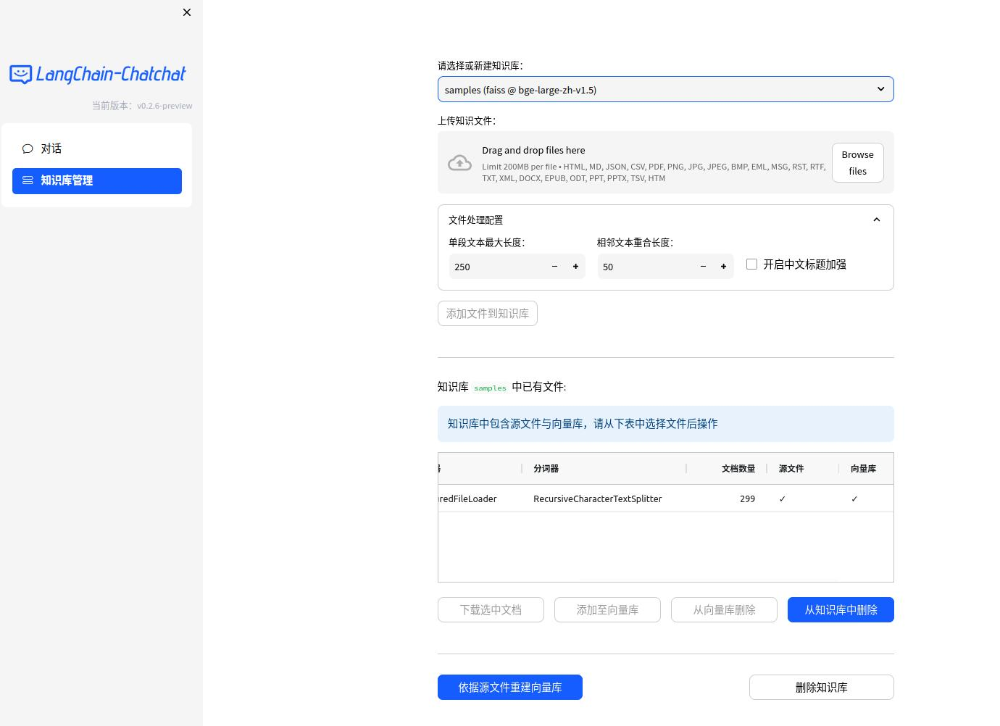

🌍 [中文文档](README.md)
🌍 [READ THIS IN ENGLISH](README_en.md)

📃 **LangChain-Chatchat** (旧名 Langchain-ChatGLM):

LLM アプリケーションは、Langchain とオープンソースまたはリモートの LLM API に基づいて、知識と検索エンジンベースの QA を実装することを目的としています。

---

## 目次

- [イントロ](README_ja.md#イントロ)
- [ペインポイントへの対応](README_ja.md#ペインポイントへの対応)
- [クイックスタート](README_ja.md#クイックスタート)
    - [1. 環境セットアップ](README_ja.md#環境セットアップ)
    - [2. モデルをダウンロード](README_ja.md#モデルをダウンロード)
    - [3. ナレッジベースと設定ファイルの初期化](README_ja.md#ナレッジベースと設定ファイルの初期化)
    - [4. ワンクリック起動](README_ja.md#ワンクリック起動)
    - [5. 起動インターフェースの例](README_ja.md#起動インターフェースの例)
- [お問い合わせ](README_ja.md#お問い合わせ)

## イントロ

🤖️ [langchain](https://github.com/hwchase17/langchain) のアイデアを用いて実装された、ローカルナレッジベースに基づく Q&A アプリケーション。
目標は、中国のシナリオとオープンソースモデルに親和性があり、オフラインとオンラインの両方で実行可能な KBQA（ナレッジベースの Q&A）ソリューションを構築することです。

💡 [document.ai](https://github.com/GanymedeNil/document.ai) と [ChatGLM-6B Pull Request](https://github.com/THUDM/ChatGLM-6B/pull/216) に触発され、
プロセス全体を通してオープンソースモデルまたはリモート LLM api を使用して実装することができるローカルナレッジベースの質問応答アプリケーションを構築します。
このプロジェクトの最新バージョンでは、[FastChat](https://github.com/lm-sys/FastChat) を使用して、Vicuna、Alpaca、LLaMA、Koala、RWKV、その他多くのモデルにアクセスしています。
このプロジェクトは [langchain](https://github.com/langchain-ai/langchain) に依存し、[FastAPI](https://github.com/tiangolo/fastapi) に基づいて提供されるAPIを通してサービスを呼び出したり、
[Streamlit](https://github.com/streamlit/streamlit) に基づいて WebUI を使ったりすることをサポートしています。

✅ オープンソースの LLM と Embedding モデルに依存して、このプロジェクトはフルプロセスの **オフラインプライベートデプロイメント** を実現することができます。
同時に、本プロジェクトは OpenAI GPT API や Zhipu API の呼び出しにも対応しており、今後も様々な機種やリモート API へのアクセスを拡大していきます。

⛓️ このプロジェクトの実施原則を下のグラフに示します。主なプロセスは以下の通りです:
ファイルの読み込み -> テキストの読み込み -> テキストのセグメンテーション -> テキストのベクトル化 -> 質問のベクトル化 -> 質問ベクトルと最も似ている `top-k` をテキストベクトルでマッチング -> マッチしたテキストをコンテキストと質問として `prompt` に追加 -> 回答を生成するために `LLM` に送信。

📺[video introduction](https://www.bilibili.com/video/BV13M4y1e7cN/?share_source=copy_web&vd_source=e6c5aafe684f30fbe41925d61ca6d514)


文書プロセスの側面からの主なプロセス分析:


🚩 トレーニングやファインチューニングはプロジェクトには含まれないが、これらを行うことで必ずパフォーマンスを向上させることができます。

🌐 [AutoDL イメージ](registry.cn-beijing.aliyuncs.com/chatchat/chatchat:0.2.5)がサポートされ、v13 では v0.2.9 にアップデートされました。

🐳 [Docker イメージ](registry.cn-beijing.aliyuncs.com/chatchat/chatchat:0.2.7)

## ペインポイントへの対応

このプロジェクトは、完全にローカライズされた推論によってナレッジベースを強化するソリューションであり、特にデータセキュリティと企業向けのプライベートな展開の問題に取り組んでいます。
このオープンソースソリューションは Apache ライセンスに基づき、無償で商用利用できます。
私たちは、市場で入手可能な主流のローカル大予言モデルや Embedding モデル、オープンソースのローカルベクターデータベースをサポートしています。
対応機種とデータベースの詳細については、[Wiki](https://github.com/chatchat-space/Langchain-Chatchat/wiki/) をご参照ください。

## クイックスタート

### 環境セットアップ

まず、マシンにPython 3.10がインストールされていることを確認してください。

```
$ python --version
Python 3.10.12
```

次に、仮想環境を作成し、プロジェクトの依存関係を仮想環境内にインストールする。

```shell

# リポジトリをクローン
$ git clone https://github.com/chatchat-space/Langchain-Chatchat.git

# ディレクトリに移動
$ cd Langchain-Chatchat

# すべての依存関係をインストール
$ pip install -r requirements.txt
$ pip install -r requirements_api.txt
$ pip install -r requirements_webui.txt

# デフォルトの依存関係には、基本的な実行環境(FAISS ベクターライブラリ)が含まれます。milvus/pg_vector などのベクターライブラリを使用する場合は、requirements.txt 内の対応する依存関係のコメントを解除してからインストールしてください。
```
LangChain-Chachat `0.2.x` シリーズは Langchain `0.0.x` シリーズ用です。Langchain `0.1.x` シリーズをお使いの場合は、ダウングレードする必要があります。

### モデルをダウンロード

このプロジェクトをローカルまたはオフライン環境で実行する必要がある場合は、まずプロジェクトに必要なモデルをダウンロードする必要があります。
通常、オープンソースの LLM と Embedding モデルは Hugging Face からダウンロードできる。

このプロジェクトで使用されているデフォルトの LLM モデルである [THUDM/chatglm2-6b](https://huggingface.co/THUDM/chatglm2-6b)と、Embedding モデル [moka-ai/m3e-base](https://huggingface.co/moka-ai/m3e-base) を例にとると、次のようになります:

モデルをダウンロードするには、まず [Git LFS](https://docs.github.com/zh/repositories/working-with-files/managing-large-files/installing-git-large-file-storage) をインストールし、次のように実行する必要があります:

```Shell
$ git lfs install
$ git clone https://huggingface.co/THUDM/chatglm2-6b
$ git clone https://huggingface.co/moka-ai/m3e-base
```

### ナレッジベースと設定ファイルの初期化

以下の手順に従って、ナレッジベースと設定ファイルを初期化してください:

```shell
$ python copy_config_example.py
$ python init_database.py --recreate-vs
 ```

### ワンクリック起動

プロジェクトを開始するには、次のコマンドを実行します:

```shell
$ python startup.py -a
```

### 起動インターフェースの例

1. FastAPI docs インターフェース


2. webui ページ

- Web UI ダイアログページ:


- Web UI ナレッジベースマネジメントページ:



### 注

上記の手順はクイックスタートのために提供されています。より多くの機能が必要な場合や、起動方法をカスタマイズしたい場合は、[Wiki](https://github.com/chatchat-space/Langchain-Chatchat/wiki/) を参照してください。

---

## お問い合わせ

### Telegram

[](https://t.me/+RjliQ3jnJ1YyN2E9)

### WeChat グループ


### WeChat 公式アカウント


