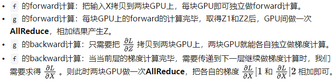
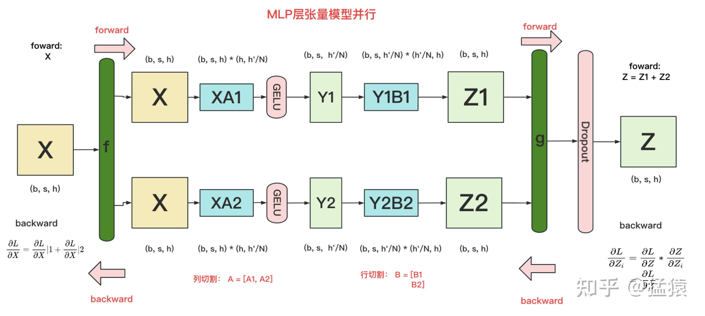
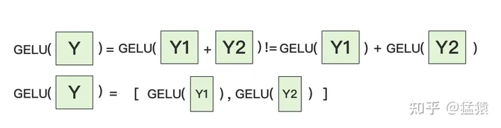
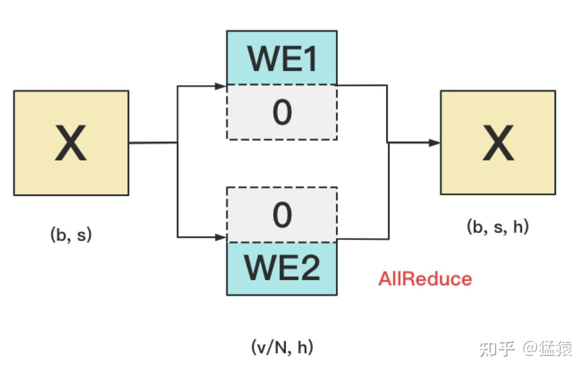
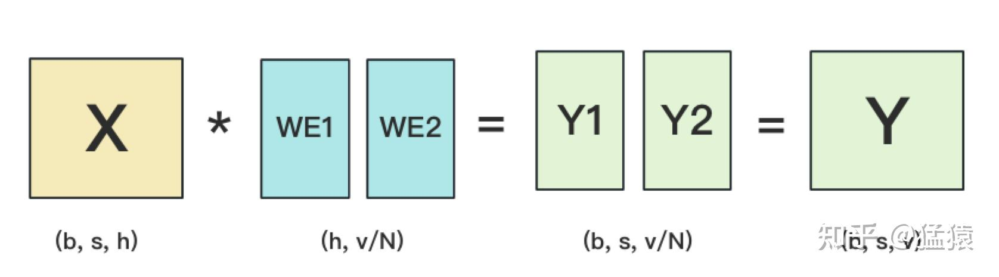
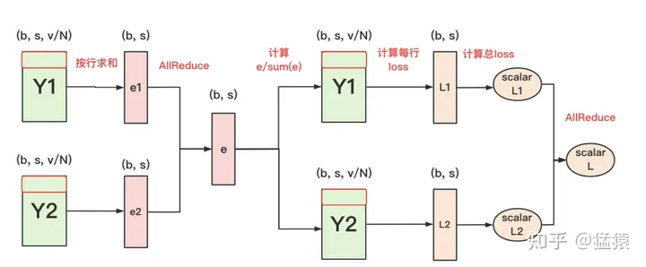
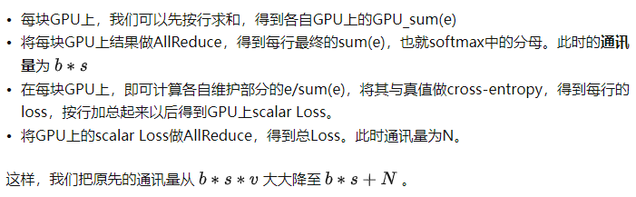
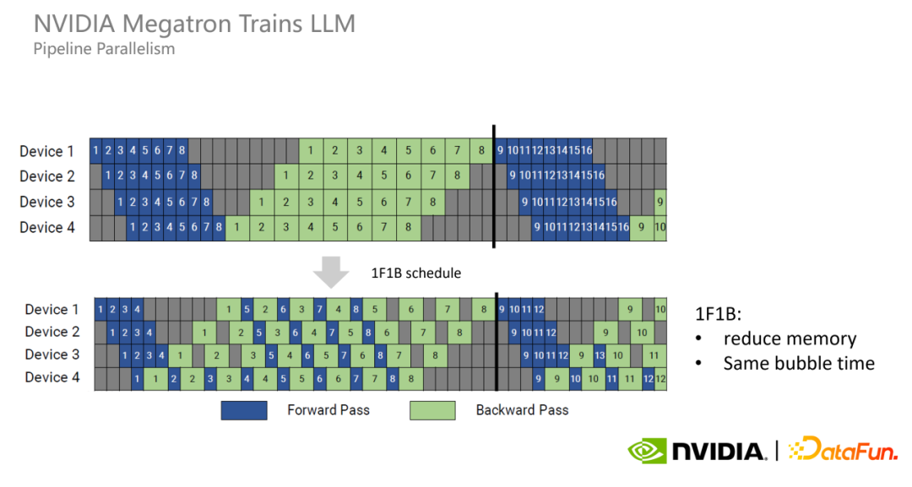
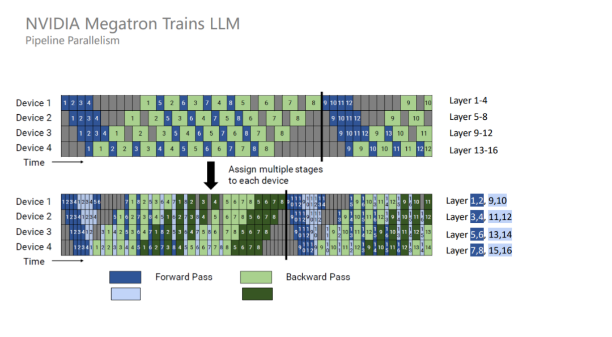
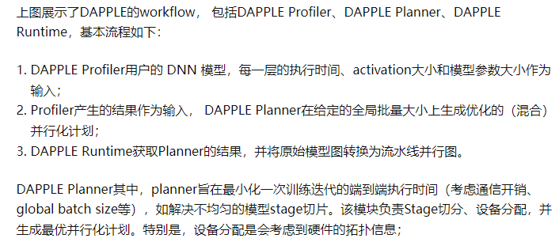

# 分布式训练技术原理
- 数据并行
    - FSDP
        - FSDP算法是由来自DeepSpeed的ZeroRedundancyOptimizer技术驱动的，但经过修改的设计和实现与PyTorch的其他组件保持一致。FSDP将模型实例分解为更小的单元，然后将每个单元内的所有参数扁平化和分片。分片参数在计算前按需通信和恢复，计算结束后立即丢弃。这种方法确保FSDP每次只需要实现一个单元的参数，这大大降低了峰值内存消耗。(数据并行+Parameter切分)
    - DDP
        - DistributedDataParallel (DDP)， **在每个设备上维护一个模型副本，并通过向后传递的集体AllReduce操作同步梯度，从而确保在训练期间跨副本的模型一致性** 。为了加快训练速度， **DDP将梯度通信与向后计算重叠** ，促进在不同资源上并发执行工作负载。
    - ZeRO
        - Model state
            - Optimizer->ZeRO1
                - 将optimizer state分成若干份，每块GPU上各自维护一份
                - 每块GPU上存一份完整的参数W,做完一轮foward和backward后，各得一份梯度,对梯度做一次 **AllReduce（reduce-scatter + all-gather）** ， **得到完整的梯度G,由于每块GPU上只保管部分optimizer states，因此只能将相应的W进行更新,对W做一次All-Gather**
            - Gradient+Optimzer->ZeRO2
                - 每个GPU维护一块梯度
                - 每块GPU上存一份完整的参数W,做完一轮foward和backward后， **算得一份完整的梯度,对梯度做一次Reduce-Scatter，保证每个GPU上所维持的那块梯度是聚合梯度,每块GPU用自己对应的O和G去更新相应的W。更新完毕后，每块GPU维持了一块更新完毕的W。同理，对W做一次All-Gather，将别的GPU算好的W同步到自己这来**
            - Parameter+Gradient+Optimizer->ZeRO3
                - 每个GPU维护一块模型状态
                - 每块GPU上只保存部分参数W，做forward时，对W做一次 **All-Gather** ，取回分布在别的GPU上的W，得到一份完整的W， **forward做完，立刻把不是自己维护的W抛弃，做backward时，对W做一次All-Gather，取回完整的W，backward做完，立刻把不是自己维护的W抛弃. 做完backward，算得一份完整的梯度G，对G做一次Reduce-Scatter，从别的GPU上聚合自己维护的那部分梯度,聚合操作结束后，立刻把不是自己维护的G抛弃。用自己维护的O和G，更新W。由于只维护部分W，因此无需再对W做任何AllReduce操作**
        - Residual state
            - activation->Partitioned Activation Checkpointing
                - 每块GPU上只维护部分的activation，需要时再从别的地方聚合过来就行。需要注意的是，activation对显存的占用一般会远高于模型本身，通讯量也是巨大的
            - temporary buffer->Constant Size Buffer
                - 提升带宽利用率。当GPU数量上升，GPU间的通讯次数也上升，每次的通讯量可能下降（但总通讯量不会变）。数据切片小了，就不能很好利用带宽了。所以这个buffer起到了积攒数据的作用：等数据积攒到一定大小，再进行通讯。
                - 使得存储大小可控。在每次通讯前，积攒的存储大小是常量，是已知可控的。更方便使用者对训练中的存储消耗和通讯时间进行预估
            - unusable fragment->Memory Defragmentation
                - 对碎片化的存储空间进行重新整合，整出连续的存储空间。防止出现总存储足够，但连续存储不够而引起的存储请求fail
        - offload
            - ZeRO-Offload
                - **forward和backward计算量高** ，因此和它们相关的部分，例如参数W（fp16），activation，就全放入GPU
                - **update的部分计算量低** ，因此和它相关的部分，全部放入CPU中。例如W(fp32)，optimizer states（fp32）和gradients(fp16)等
                - ZeRO-Offload 分为 Offload Strategy 和 Offload Schedule 两部分，前者解决如何在 GPU 和 CPU 间划分模型的问题，后者解决如何调度计算和通信的问题
            - ZeRO-Infinity
                - 一是将offload和 ZeRO 的结合从 ZeRO-2 延伸到了 ZeRO-3，解决了模型参数受限于单张 GPU 内存的问题
                - 二是解决了 ZeRO-Offload 在训练 batch size 较小的时候效率较低的问题
                - 三是除 CPU 内存外，进一步尝试利用 NVMe 的空间
- 模型并行
    - tensor-wise parallelism
        - MLP切分
            - 对第一个线性层按列切分，对第二个线性层按行切分
            -  
            -  
            -  
        - self-attention切分
            - attention的多头计算天然适合tensor并行，因为每个头上都可以独立计算最后再将结果concat起来，从而 **可以把每个头的参数放到一块GPU上**
            - 对线性层， **按照“行切割”** 。切割的方式和MLP层基本一致，其forward与backward原理也一致
        - 输入层Embedding切分
            - 对positional embedding来说，max_s本身不会太长，因此每个GPU上都拷贝一份，对显存的压力也不会太大
            - 将word embedding拆分到不同GPU上，每块GPU维护一分部词表。当输入X去GPU上查找时，能找到的词，就正常返回词向量，找到不到就把词向量中的全部全素都置0。按此方式查找完毕后，每块GPU上的数据做一次AllReduce，就能得到最终的输入。
            -  
        - 输出层Embedding切分
            - **输入层和输出层共用一个word embeding**
            - **当模型的输入层到输入层都在一块GPU上时（即流水线并行深度=1），我们不必担心这点（实践中大部分用Megatron做并行的项目也是这么做的）。但若模型输入层和输出层在不同的GPU上时，我们就要保证在权重更新前，两块GPU上的word embedding梯度做了一次AllReduce** 。
            -  
        - cross-entroy
            -  
            -  
    -  [pipeline paralelism]("https://zhuanlan.zhihu.com/p/629637468")
        - GPipe
        - PipeDream
        - 1F1B
            - 每个 GPU 以交替的方式执行每个 micro batch 的正向和反向过程，以尽早释放其占用的显存，进而减少显存占用
                -  
            - 1F1B 并不能减少 bubble time， **为了进一步减少 bubble time，Megatron 又提出了 interleaved 1F1B 模式** 。也就是原本每个 GPU 负责连续 4 个层的计算，现在变成负责连续两个层的计算，只有原来的一半，从而 bubble time 也变成了原来的一半,即把一个设备上连续的层划分为若干不连续的层，负责的数量不变，但顺序变了。
                -  
        - DAPPLE
            -  
    - layer-wise parallelism
    - sequence parallelism
        - Sequence 并行的好处在于不会增加通信量，并且可以大大减少显存占用
        - Layer-norm 和 Dropout 沿着序列的维度是独立的，因此可以按照 Sequence 维度进行拆分
        - 使用了 Sequence 并行之后，对于超大规模的模型而言，其实显存占用量还是很大的。因此，Megatron 又引入了激活重计算技术，找到一些计算量很少但显存占用很大的算子，比如 Attention 里的 Softmax、Dropout 等算子，对这些算子进行激活重计算就可以显著减少显存，并且计算开销增加不大
- MoE
    - 核心思想：将大模型拆分成多个小模型。每个样本只需要激活部分专家模型进行计算，从而大大节省计算资源。 **MoE 的基本思路是通过宽度换取深度，因为模型深度越深，计算层数越多，进而推理时间越长**
    - Hard Gate MoE
    - Sparse MoE