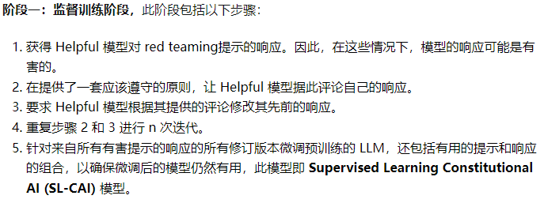
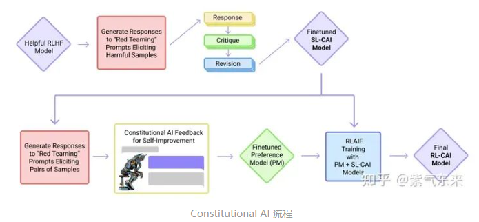
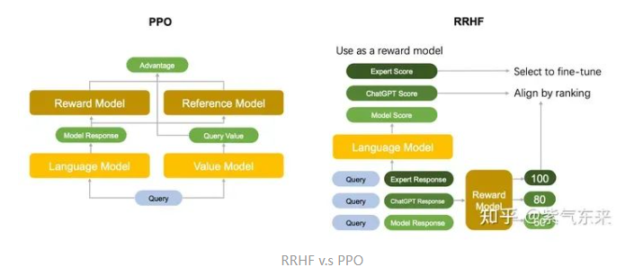

# 大模型指令对齐训练原理
- RLHF
    - SFT
    - RM
    - PPO
- AIHF-based
    - RLAIF
        - 核心在于通过AI 模型监督其他 AI 模型，即在SFT阶段，从初始模型中采样，然后生成自我批评和修正，然后根据修正后的反应微调原始模型。在 RL 阶段，从微调模型中采样，使用一个模型来评估生成的样本，并从这个 AI 偏好数据集训练一个偏好模型。然后使用偏好模型作为奖励信号对 RL 进行训练
        -  
        -  
        -  
    - RRHF
        - RRHF( **R** ank **R** esponse from **H** uman **F** eedback) 不需要强化学习，可以利用不同语言模型生成的回复，包括 ChatGPT、GPT-4 或当前的训练模型。RRHF通过对回复进行评分，并通过排名损失来使回复与人类偏好对齐。RRHF 通过通过排名损失使评分与人类的偏好（或者代理的奖励模型）对齐。RRHF 训练好的模型可以同时作为生成语言模型和奖励模型使用。
        -  
- SFT-only
    - LIMA
        - LIMA(Less Is More for Alignment) 即浅层对齐假说，即一 **个模型的知识和能力几乎完全是在预训练中学习的，而对齐则是教会它与用户交互时如何选择子分布** 。如果假说正确，对齐主要有关于学习方式，那么该假说的一个推论是，人们可以用相当少的样本充分调整预训练的语言模型。因此， **该工作假设，对齐可以是一个简单的过程，模型学习与用户互动的风格或格式，以揭示在预训练中已经获得的知识和能力。**
    - LTD Instruction Tuning
        -  
- Reward-only
    - DPO
        - DPO(Direct Preference Optimization) 提出了一种使用二进制交叉熵目标来精确优化LLM的方法，以替代基于 RL HF 的优化目标，从而大大简化偏好学习 pipeline。也就是说，完全可以直接优化语言模型以实现人类的偏好，而不需要明确的奖励模型或强化学习。
        - DPO 也依赖于理论上的偏好模型（如 Bradley-Terry 模型），以此衡量给定的奖励函数与经验偏好数据的吻合程度。然而，现有的方法使用偏好模型定义偏好损失来训练奖励模型，然后训练优化所学奖励模型的策略，而 DPO 使用变量的变化来直接定义偏好损失作为策略的一个函数。鉴于人类对模型响应的偏好数据集，DPO 因此可以使用一个简单的二进制交叉熵目标来优化策略，而不需要明确地学习奖励函数或在训练期间从策略中采样。
    - RAFT
        -  
- 参考文献
    -  [反思RLHF]("https://mp.weixin.qq.com/s/e3E_XsZTiNMNYqzzi6Pbjw")
    -  [RLHF笔记]("https://mathpretty.com/16017.html")
    -  [hf-blog]("https://huggingface.co/blog/zh/rlhf")
    - ** [RLHF代码详解]("https://zhuanlan.zhihu.com/p/624589622")