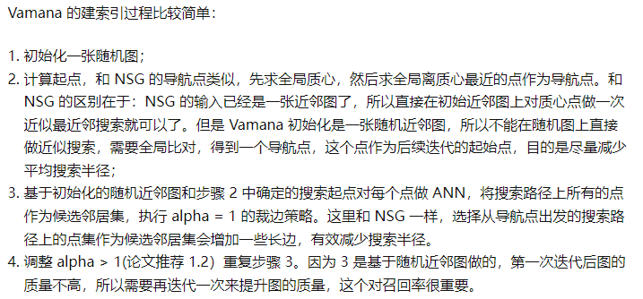
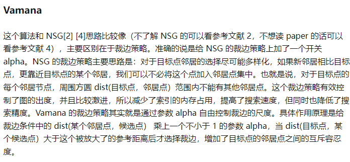
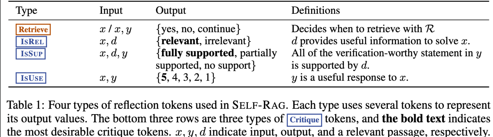
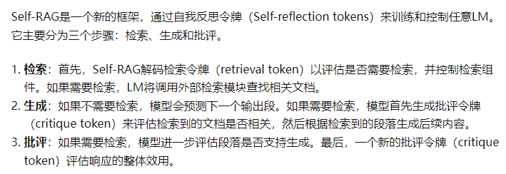

# 大模型应用技术原理
- RAG
    - 向量数据库 [对比]("https://www.jianshu.com/p/43cc19426113")
        - 选型标准
            - 开源vs.闭源vs. 源码可见
            - 客户端/SDK语言
            - 托管方式
                - self-hosted/on-premise
                    - redis,pgvector,milvus
                - managed/cloud-native
                    - zilliz,pinecone
                - embeded+cloud-native
                    - chroma,lanceDB
                - self-hosted+cloud-native
                    - vald,drant,weaviate,vspa,elasticsearch
            - 索引方法
                - 算法
                    - Flat
                    - Tree-based
                        - Annoy(Approximate Nearest Neighbors Oh Yeah)
                        - KD-Tree
                        - Trinary Projection Trees
                    - IVF
                        - IVF
                        - IVMF(Inverted Multi-index File)
                    - Graph-based
                        - HNSW
                        - NSG
                        - Vamana(DiskANN)
                            -  
                            -  
                    - Hashing-based
                        - LSH
                        - Spherical Hashing
                        - Spectral Hashing
                - 量化
                    - PQ（Product Quantization）
                        - PQ 将特征空间分解为多个低维子空间的笛卡尔乘积，然后单独地对每一个子空间进行量化
                    - SQ（Scalar Quantization）
                        - SQ是将每一个维度量化成指定位数的一个数
        - 主流方案
            - professional
                - weaviate
                    - 1. 文档丰富，容易上手
                    - 2. 提供混合索引
                    - 3. 支持自托管+云原生
                    - 4.支持python,js,ts,go,java等客户端
                    - 5. 支持HNSW,HNSW-PQ,DisANN等索引
                - chroma
                - LanceDB
                - pinecone
                    - 1. 完全云原生，非常容易上手
                    - 2. 自建复合索引
                - faiss
                    - 1.来自 Meta AI（原 Facebook Research）的开源项目
                    - 2.同时支持cpu和GPU两种设备
                    - 3. 支持C++,python, go等客户端
                    - 4. 支持常见的索引方式，如IVF,HNSW,支持PQ量化
                    - 5. in-memory运行
                    - 6. self-hosted
                - milvus
                    - 1. 通过代理、负载均衡器、消息代理、Kafka和Kubernetes的组合实现了高度可扩展性，这使得整个系统变得非常复杂和资源密集
                    - 2. 截至2023年，它是唯一一个提供可工作的DiskANN实现的主要供应商
                    - 3. 支持在向量相似度检索过程中进行标量字段过滤，实现混合查询
                    - 4. 采用 **存储与计算分离** 的架构设计
                    - 5. 提供python,juava,go,node.js等语言SDK,也提供milvus lite等in-momery运行
                    - 6. 提供了图形界面客户端
            - traiditional
                - ES
                - redis
                - pgvector
    - Embedding模型
        - bi-encoder
        - cross-encoder
    - 【可选】文本检索引擎
        - ElasticSearch
        - OpenSearch
    - 【可选】图数据库
    - 检索
        - 向量检索
        - 关键字检索
            - BM25
        - NL2Cypher
        - NL2SQL
    - RAG增强
        - Self-RAG
            - 框架
                - 自反思检索增强生成（Self-RAG, Self-Reflective Retrieval-Augmented Generation）。这是一个新框架，它不仅可以根据需要自适应地检索段落（即：模型可以判断是否有必要进行检索增强），还引入了名为反思令牌（reflection tokens）的特殊令牌，使LM在推理阶段可控。
                -  
                -  
            - 训练
                - 首先，训练评论家，使用检索器检索到的段落以及反思令牌增强指令-输出数据，然后，使用标准的下一个 token 预测目标来训练生成器 LM，以学习生成 自然延续(continuations)以及特殊 tokens (用来检索或批评其自己的生成内容).
            - 推理
                - 它可以适应性地使用检索令牌进行检索，因此模型可以自发判断是不是有必要进行检索。它引入了多种细粒度的批评令牌，这些令牌用于评估生成内容的各个方面的质量。在生成过程中，作者使用期望的批评令牌概率的线性插值进行segment级的beam search，以在每一个时间步骤中确定最佳的K个续写方案
- Agent
    - function call
        - ToolFormer