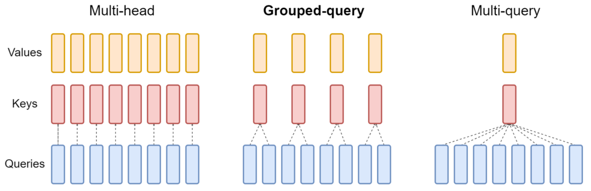
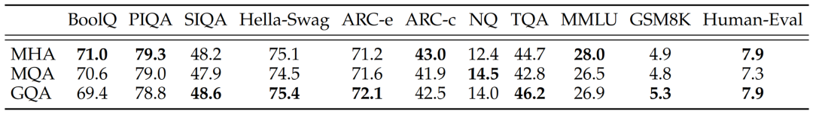
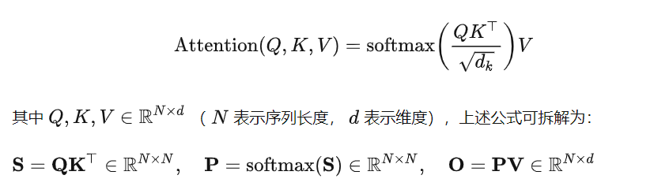
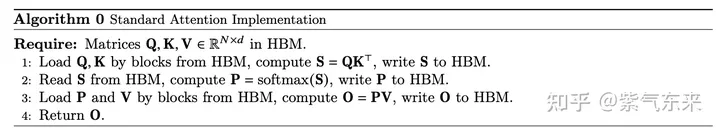
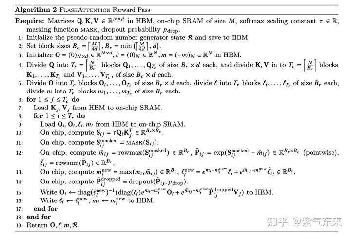
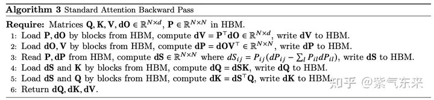
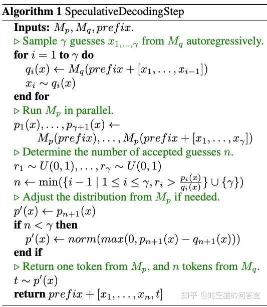

# 大模型推理优化策略
- 7.1 显存优化
    -  [PagedAttention]("https://zhuanlan.zhihu.com/p/638468472")
        - KV cache，其具有以下特点:1. 显存占用大，14b级别的模型，每个token需要约0.7M-1M的显存；2. 动态变化：KV 缓存的大小取决于序列长度，这是高度可变和不可预测的。因此，这对有效管理 KV cache 挑战较大。该研究发现，由于碎片化和过度保留，现有系统浪费了 60% - 80% 的显存。
        - 为了解决这个问题，该研究引入了 PagedAttention，这是一种受操作系统中虚拟内存和分页经典思想启发的注意力算法。与传统的注意力算法不同，PagedAttention 允许在非连续的内存空间中存储连续的 key 和 value 。具体来说，PagedAttention 将每个序列的 KV cache 划分为块，每个块包含固定数量 token 的键和值。在注意力计算期间，PagedAttention 内核可以有效地识别和获取这些块。因为块在内存中不需要连续，因而可以用一种更加灵活的方式管理 key 和 value ，就像在操作系统的虚拟内存中一样：可以将块视为页面，将 token 视为字节，将序列视为进程。序列的连续逻辑块通过块表映射到非连续物理块中。物理块在生成新 token 时按需分配。在 PagedAttention 中，内存浪费只会发生在序列的最后一个块中。这使得在实践中可以实现接近最佳的内存使用，仅浪费不到 4%。
        - PagedAttention 还有另一个关键优势 —— 高效的内存共享。例如在并行采样中，多个输出序列是由同一个 prompt 生成的。在这种情况下，prompt 的计算和内存可以在输出序列中共享。PagedAttention 自然地通过其块表格来启动内存共享。与进程共享物理页面的方式类似，PagedAttention 中的不同序列可以通过将它们的逻辑块映射到同一个物理块的方式来共享块。为了确保安全共享，PagedAttention 会对物理块的引用计数进行跟踪，并实现写时复制（Copy-on-Write）机制。PageAttention 的内存共享大大减少了复杂采样算法的内存开销，例如并行采样和集束搜索的内存使用量降低了 55%。这可以转化为高达 2.2 倍的吞吐量提升。
        - continuous batching
        - CUDA kernel优化
    - Qunatized KV Cache
    - MQA/GQA
        - 核心思想是检索kv-cache的数量，以少量kv-cache对应多个query 
        -  
    -  [FlashAttention]("https://zhuanlan.zhihu.com/p/638468472")
        - 解释1：记I为模型的计算强度I，单位FLOP/byte代表模型进行单位byte数据交互可实现的操作数,则I*带宽beta即模型的计算性能，单位为FLOP/s。令I_max=计算平台算力/计算平台带宽，当模型的计算强度I小于平台的理论计算强度I_max，模型的计算能力P即I*beta,当模型的计算强度大于I_max,则模型的计算性能P等于平台的算力。故若模型的计算强度小，则瓶颈在带宽，若模型的计算强度大，则瓶颈在算力。为提高计算性能，需提高计算强度，即每bytes数据交互的操作数。
        - 解释2：记N=每次操作要求的FLOP,单位FLOP/OP；pi=平台的算力，单位FLOP/s;beta=内存带宽，单位byte/s；P=实际实现计算速度，单位为FLOP/s；优化目标为O=P/N每秒钟实现的运算次数，单位为OP/s.由于N固定，故优化目标转而为P，P=min{beta_r*I_max=beta_r*pi/beta,pi}，故优化目标转而为beta，即改变内存访问策略，实现beta最大化。
        - 注意力操作中，S和P的计算空间复杂度都是O(N^2),此外,scale,mask,softmax,dropout都是带宽约束操作。 
        -  
        - 可以看出，O(N^2)空间复杂度的矩阵计算对HBM的读写是主要的内存瓶颈，因此主要优化点是：1. 在不访问整个输入的情况下计算softmax;2. 不为反向传播存储大的中间attention矩阵。FlashAttention提出两种方法来分步解决上述问题：tiling,recomputation.tiling - 注意力计算被重新构造，将输入分割成块，并通过在输入块上进行多次传递来递增地执行softmax操作。recomputation - 存储来自前向的 softmax 归一化因子，以便在反向中快速重新计算芯片上的 attention，这比从HBM读取中间矩阵的标准注意力方法更快。由于重新计算，这确实导致FLOPs增加，但是由于大量减少HBM访问，FlashAttention运行速度更快。该算法背后的主要思想是分割输入，将它们从慢速HBM加载到快速SRAM，然后计算这些块的 attention 输出。在将每个块的输出相加之前，将其按正确的归一化因子进行缩放，从而得到正确的结果。
        -  
        -  
    - 参考文献
        -  [推理优化]("https://zhuanlan.zhihu.com/p/656485997") [推理优化]("https://zhuanlan.zhihu.com/p/656485997")
- 7.2 算子融合
- 7.3 延迟优化
    - No Padding优化
- 7.4 调度优化
    - Dynamic Batching
        - 批次大小固定不变，无法随计算资源负载动态变化，导致 GPU 资源利用率低
        - 通过维护一个作业队列实现,在 batch 维度动态插入新序列
    - Async Servering
        - Tokenize / Detokenize 过程在 CPU 上执行，期间 GPU 处于空闲状态
        - 多线程异步,流水线 overlap 实现降低时延
    - Inflight Batching/continuous batching
        - 同批次序列推理时，存在“气泡”，导致 GPU 资源利用率低
        - 由 batch 粒度的调度细化为 step 级别的调度,在时间轴方向动态插入新序列
- 7.5 量化
    - GPTQ
    - AWQ
    - SmoothQuant
    - SpQR
- 7.6 模型并行
    - tensor paralellism加速+降显存
    - pipeline paralellism减少显存
- 7.7 请求优化
    -  [网络通信]("https://article.juejin.cn/post/7226374741064892453")
        - rpc
        - grpc
        - http
    -  [响应模式]("https://blog.csdn.net/weixin_44999716/article/details/128436984")
        - SSE
        - 轮询
        - 长轮询comet
        - WebSocket
- 7.8 采样/解码
    - speculative decoding
        -  
    - Blockwise *Parallel*  *Decoding*
    - Medusa
    - SOT - Parallel Decoding
    - SpecInfer
    - StreamingLLM
- 参考资料
    -  [最佳实践]("https://mp.weixin.qq.com/s/nJLrE9Dzj1mmTeQDiqNdzA")