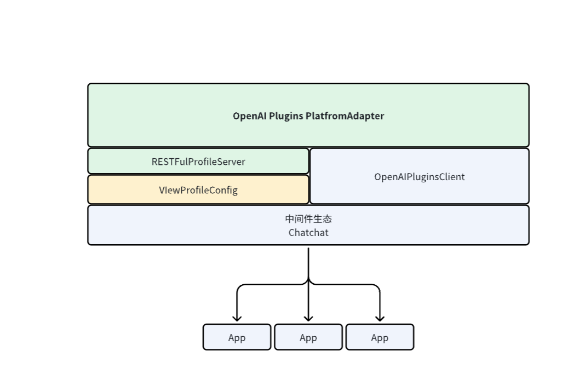

# Model Runtime

This module is the loading module that unifies Dify's supplier information and credential form. The project has an OpenAI service forwarding capability at the upper layer, which can support the conversion of supplier services to OpenAI EndPoint calls.

On the basis of the original, this module has added `VIewProfileConfig`, `RESTFulProfileServer`, `OpenAIPluginsClient`, and has rewritten the logic for loading supplier configuration, focusing only on the supplier's configuration. The model configuration and calling logic are implemented in this module, providing a separation of model calls for `Chatchat`. The benefits of doing so are:
- It changes the decoupling method between the model and the upstream and downstream callers.
- During development, one does not need to pay attention to the specific implementation of the service provider module, but can simply make calls through the OpenAI EndPoint provided by Model Runtime.

> Please note! Because the model configuration storage module has been removed, the ability to operate suppliers and models on the front-end page has been deleted accordingly. Now, it is only possible to configure suppliers and models through a backend yaml file.
> Only a supplier configuration details interface is provided, and in the future, we will consider providing a model configuration details interface through other means.

## Features

- Supports capability invocation for 5 types of models

  - `LLM` - LLM text completion, dialogue, pre-computed tokens capability
  - `Text Embedding Model` - Text Embedding, pre-computed tokens capability
  - `Rerank Model` - Segment Rerank capability
  - `Speech-to-text Model` - Speech to text capability
  - `Text-to-speech Model` - Text to speech capability
  - `Moderation` - Moderation capability

- Model provider display

  Displays a list of all supported providers, including provider names, icons, supported model types list, predefined model list, configuration method, and credentials form rules, etc. For detailed rule design, see: [Schema](./schema.md).

- Provider/model credential authentication
  The provider list returns configuration information for the credentials form, which can be authenticated through Runtime's interface. 

## Structure

Model Runtime is divided into three layers:

- The outermost layer is the OpenAI EndPoint publishing layer

  It provides asynchronous loading configuration `VIewProfileConfig`
  Supplier service publishing `RESTFulProfileServer`

- The second layer is the provider layer

  It provides the current provider's model list, model instance obtaining, provider credential authentication, and provider configuration rule information, **allowing horizontal expansion** to support different providers.
  For supplier/model credentials, there are two situations:
  - For centralized suppliers like OpenAI, you need to define authentication credentials like **api_key**.
  - For locally deployed suppliers like [**Xinference**](https://github.com/xorbitsai/inference), you need to define address credentials like **server_url**. Sometimes you also need to define model type credentials like **model_uid**.

- The bottom layer is the model layer

  It provides direct calls for various model types, predefined model configuration information, obtaining predefined/remote model lists, model credential authentication methods, and different models provide special methods, such as LLM providing pre-computed tokens methods, obtaining cost information methods, etc., **which can be scaled horizontally** for different models under the same supplier (under the supported model types).
  
  Here we need to distinguish between model parameters and model credentials first.

  - Model parameters (**defined in this layer**): These are parameters that often need to be changed and adjusted at any time, such as LLM's **max_tokens**, **temperature**, etc. These parameters are adjusted by users on the front-end page, so it is necessary to define the rules of parameters on the backend to facilitate the display and adjustment on the front-end page. In DifyRuntime, their parameter names are generally **model_parameters: Dict[str, any]**.

  - Model credentials (**defined in the supplier layer**): These are parameters that do not often change and generally do not change after configuration, such as **api_key**, **server_url**, etc. In DifyRuntime, their parameter names are generally **credentials: Dict[str, any]**. The credentials of the Provider layer will be directly passed to this layer, and there is no need to define them separately.

 

### If you want to implement a custom service provider model capability
- [Go here 👈🏻](./docs/en_US/interfaces.md)
- [Details about custom models](./docs/en_US/provider_scale_out.md)
