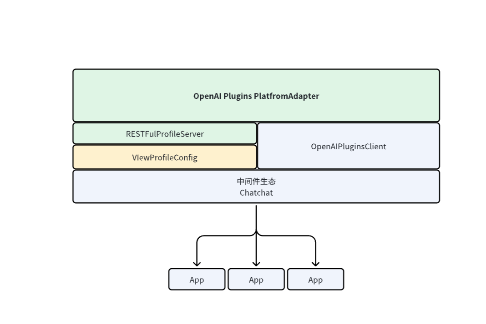

# Model Runtime

该模块是Dify 统一供应商信息和凭据表单的加载模块，此项目在上层做了openai服务转发能力，可以支持对供应商服务转换为 OpenAI EndPoint的调用

该模块在原有的基础上，增加了`VIewProfileConfig`、`RESTFulProfileServer`、`OpenAIPluginsClient`重写了供应商配置加载逻辑，仅关注供应商的配置，
模型的配置和调用逻辑在本模块实现， 为`Chatchat`提供了模型调用的分离，这样做的好处是：
- 改变了模型和上下游调用方解耦方式
- 在开发时，不需要关注服务商模块的具体实现，仅通过Model Runtime提供的OpenAI EndPoint调用即可

> 请注意！因为删除了模型配置的存储模块，原本在前端页面操作供应商和模型的能力因此被删除，现在只能通过后端yaml文件配置供应商和模型，
> 仅提供了供应商的配置详情接口，未来会考虑通过其他方式提供模型的配置详情接口

## 功能介绍

- 支持 5 种模型类型的能力调用

  - `LLM` - LLM 文本补全、对话，预计算 tokens 能力
  - `Text Embedidng Model` - 文本 Embedding ，预计算 tokens 能力
  - `Rerank Model` - 分段 Rerank 能力
  - `Speech-to-text Model` - 语音转文本能力
  - `Text-to-speech Model` - 文本转语音能力
  - `Moderation` - Moderation 能力

### 删除Dify配置页面的情况下，保留了以下功能：
- 模型供应商展示
展示所有已支持的供应商列表，除了返回供应商名称、图标之外，还提供了支持的模型类型列表，预定义模型列表、配置方式以及配置凭据的表单规则等等，规则设计详见：[Schema](./docs/zh_Hans/schema.md)。

- 供应商/模型凭据鉴权 
 供应商列表返回了凭据表单的配置信息，可通过 Runtime 提供的接口对凭据进行鉴权， 

## 结构

Model Runtime 分三层：

- 最外层为OpenAI EndPoint发布层

  提供异步加载配置`VIewProfileConfig`
  供应商服务发布`RESTFulProfileServer` 

- 第二层为供应商层

  提供获取当前供应商模型列表、获取模型实例、供应商凭据鉴权、供应商配置规则信息，**可横向扩展**以支持不同的供应商。

  对于供应商/模型凭据，有两种情况
  - 如OpenAI这类中心化供应商，需要定义如**api_key**这类的鉴权凭据
  - 如[**Xinference**](https://github.com/xorbitsai/inference)这类本地部署的供应商，需要定义如**server_url**这类的地址凭据，有时候还需要定义**model_uid**之类的模型类型凭据， 
 
- 最底层为模型层

  提供各种模型类型的直接调用、预定义模型配置信息、获取预定义/远程模型列表、模型凭据鉴权方法，不同模型额外提供了特殊方法，如 LLM 提供预计算 tokens 方法、获取费用信息方法等，**可横向扩展**同供应商下不同的模型（支持的模型类型下）。

  在这里我们需要先区分模型参数与模型凭据。

  - 模型参数(**在本层定义**)：这是一类经常需要变动，随时调整的参数，如 LLM 的 **max_tokens**、**temperature** 等，这些参数是由用户在前端页面上进行调整的，因此需要在后端定义参数的规则，以便前端页面进行展示和调整。在DifyRuntime中，他们的参数名一般为**model_parameters: Dict[str, any]**。

  - 模型凭据(**在供应商层定义**)：这是一类不经常变动，一般在配置好后就不会再变动的参数，如 **api_key**、**server_url** 等。在DifyRuntime中，他们的参数名一般为**credentials: Dict[str, any]**，Provider层的credentials会直接被传递到这一层，不需要再单独定义。

 
 

 
### 如果你想实现自定义的服务商模型能力
- [移步这里 👈🏻](./docs/zh_Hans/interfaces.md)
- [关于自定义模型的细节](./docs/zh_Hans/provider_scale_out.md)
 
